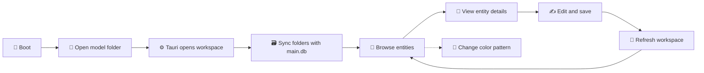

# HASM Model Editor 🌟

HASM is a local model format for organizing **people, experiences, facts, and links**. 🧩
The HASM Model Editor is a small desktop app for opening that model, browsing its sections, and editing entity details. ✍️

## What is HASM? 💡

HASM keeps model data close to the files that describe it: folders hold entity Markdown, while a local SQLite database helps the app browse and save structured metadata. 📁🗃️

## Repository status and contribution policy

Thank you for your interest in this repository and for taking the time to explore the project. HASM is currently in an early stage of development, and its maturity remains limited. The project is being developed gradually and intentionally, step by step, at a pace that is appropriate for its current stage.

At this time, external contributions are not being accepted. The repository is being shaped and refined independently by the maintainer, and the current focus is on establishing a stable foundation before broader collaboration is considered. We sincerely appreciate your interest and kindly ask that you respect this direction while the project continues to evolve.

The editor is designed for a simple loop:

- 📂 Open a model folder
- 🧭 Browse PERSON, EXPERIENCE, FACT, and LINK
- 🔎 Open an entity detail view
- 💾 Edit and save metadata
- 🎨 Switch the workspace color pattern

## Current flow 🔄



## Status 🧩

| Area | Status | Short description |
|---|---|---|
| App boot | ✅ | Start the desktop workspace flow |
| Model open | ✅ | Open a model folder and read its sections |
| Entity browsing | ✅ | Browse PERSON, EXPERIENCE, FACT, and LINK |
| Entity details | ✅ | Read and edit detail records |
| Save and refresh | ✅ | Save through Tauri and reload the workspace |
| New model creation | 🚧 | Planned next |
| Rich relationship visualization | 🚧 | Planned after the core editor |

## Tech stack 🛠️

[](https://react.dev/)
[](https://vite.dev/)
[](https://tauri.app/)
[](https://www.rust-lang.org/)
[](https://www.sqlite.org/)

- 🖥️ Frontend: React + Vite
- ⚡ Desktop shell and bridge: Tauri 2
- 🦀 Backend: Rust
- 🗃️ Storage: local folders, Markdown, and SQLite `main.db`
- 🎨 Theme package: `src/hasm_color_pattern`
- 📝 Logging package: `src/hasm_logger`

## Getting started ▶️

Install dependencies:

```bash
npm install
```

Run the app in development mode:

```bash
npm run tauri dev
```

Build for production:

```bash
npm run build
npm run tauri:build
```

`npm run build` builds the `hasm_markdown` submodule in release mode and stages its output as `src-tauri/binaries/hasm_markdown.exe` before building the frontend. `npm run tauri:build` packages that staged executable with the desktop application.

## Project structure 📁

```text
src/
├── features/hasm/          # Boot, open, browse, detail, and Tauri API flow
├── hasm_color_pattern/      # Reusable color patterns and theme helpers
├── hasm_logger/             # Frontend logging helpers
├── App.jsx                 # App entry component
└── main.jsx                # React entry point
src-tauri/
├── src/hasm/                # Rust commands, services, types, and definitions
├── src/hasm_logger/         # Rust logging support
└── Cargo.toml              # Rust dependencies and build settings
docs/
├── arch/                    # Architecture and sequence plans
├── req/                     # Requirements
└── eval/                    # Evaluation and test specifications
package.json                # Frontend scripts and dependencies
vite.config.js              # Vite configuration
```

## Roadmap 🗺️

1. 🚧 **Workspace creation**: create a new HASM folder from the app.
2. 🧪 **Validation and recovery**: clearer checks for missing or invalid model data.
3. 🌐 **Relationship views**: make links and experience paths easier to explore.
4. 📦 **Import and export**: support more practical model exchange workflows.

The detailed architecture, requirements, and evaluation plans live in [`docs/`](docs/), including the current sequence documents for loading, visualization, editing, recovery, and entity creation. 📚

## License 📜

This project is licensed under the GNU General Public License v3.0.
See [LICENSE](LICENSE) for details.
