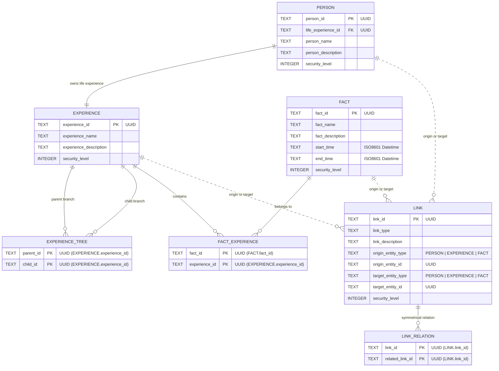

# HASM Model Database Structure

This document defines the storage layout, relational database schema (`hasm.db`), and the in-memory Rust domain model for the Human Activity Structuring Model (HASM).

---

## 1. Overview & Storage Architecture

The HASM model represents subjective human experiences, facts, persons, and relationships (links) through four primary entity types:

* **PERSON**: Core identity unit within the HASM model.
* **EXPERIENCE**: Subjective timeline branch and contextual container for facts.
* **FACT**: Concrete historical event bounded by time.
* **LINK**: Directed relationship connecting any two entities.

To achieve clean separation between human-readable content and structural metadata, HASM uses a hybrid persistence architecture:

1. **Local File System (HASM Markdown & Assets)**: Large text contents, detailed descriptions, and media assets are stored as standard Markdown files (`main.md`) and asset directories (`assets/`). This ensures offline accessibility, compatibility with external text editors, and seamless version control via Git.
2. **Relational Database (`hasm.db`)**: High-performance metadata, structural foreign key relationships, junction tables, and entity indices are managed within a local SQLite database (`hasm.db`).

### Workspace Storage Layout

```
my.hasm/
  |-- hasm.db
  |-- EXPERIENCE/
  |   `-- {UUID}/
  |       |-- main.md (HASM Markdown)
  |       `-- assets/ (Images and media files)
  |-- FACT/
  |   `-- {UUID}/
  |       |-- main.md (HASM Markdown)
  |       `-- assets/
  |-- LINK/
  |   `-- {UUID}/
  |       |-- main.md (HASM Markdown)
  |       `-- assets/
  `-- PERSON/
      `-- {UUID}/
          |-- main.md (HASM Markdown)
          `-- assets/

```

---

## 2. Relational Database Model (`hasm.db`)

The SQLite database (`hasm.db`) maintains structural metadata and many-to-many junction tables (`EXPERIENCE_TREE`, `FACT_EXPERIENCE`, `LINK_RELATION`) to enable fast querying and graph traversals.

### Entity Relationship Diagram (ERD)



---

### Detailed Schema Definitions

#### PERSON

Primary unit representing an individual. Every `PERSON` owns one mandatory root branch specified by `life_experience_id`.

* **`person_id`** (*UUID, Primary Key*): Unique identifier for the person.
* **`life_experience_id`** (*UUID, Foreign Key*): Root `EXPERIENCE` ID representing the individual's entire life stream.
* **`person_name`** (*TEXT*): Name or handle of the person.
* **`person_description`** (*TEXT*): Short overview or summary.
* **`security_level`** (*INTEGER*): Access control level ($0 \le \text{level} \le 5$).

#### EXPERIENCE

Represent subjective contextual groupings of facts (e.g., projects, education periods, career milestones).

* **`experience_id`** (*UUID, Primary Key*): Unique identifier for the experience.
* **`experience_name`** (*TEXT*): Title of the experience.
* **`experience_description`** (*TEXT*): Overview of the experience stream.
* **`security_level`** (*INTEGER*): Access control level.

##### `EXPERIENCE_TREE` (Junction Table)

Models Git-like branching and parent-child hierarchies between experience streams.

* **`parent_id`** (*UUID, PK, FK*): Base `EXPERIENCE` from which branching originates.
* **`child_id`** (*UUID, PK, FK*): Dependent `EXPERIENCE` affected by or branching off the parent.

#### FACT

Concrete events or occurrences anchored in time.

* **`fact_id`** (*UUID, Primary Key*): Unique identifier for the fact.
* **`fact_name`** (*TEXT*): Short summary of the fact.
* **`fact_description`** (*TEXT*): Detailed factual description.
* **`start_time`** (*TEXT*): ISO8601 timestamp for event start.
* **`end_time`** (*TEXT*): ISO8601 timestamp for event completion (optional).
* **`security_level`** (*INTEGER*): Access control level.

##### `FACT_EXPERIENCE` (Junction Table)

Maps facts onto experience timelines (many-to-many relationship).

* **`fact_id`** (*UUID, PK, FK*): Reference to the associated `FACT`.
* **`experience_id`** (*UUID, PK, FK*): Reference to the containing `EXPERIENCE`.

#### LINK

Polymorphic directed relationship connecting any two entities (`PERSON`, `EXPERIENCE`, or `FACT`).

* **`link_id`** (*UUID, Primary Key*): Unique identifier for the link.
* **`link_type`** (*TEXT*): Categorical relationship type (e.g., `"causes"`, `"references"`, `"mentors"`).
* **`link_description`** (*TEXT*): Contextual explanation of the relationship.
* **`origin_entity_type`** (*TEXT*): Source entity classification (`"Person"`, `"Experience"`, or `"Fact"`).
* **`origin_entity_id`** (*UUID*): Target ID of the source entity.
* **`target_entity_type`** (*TEXT*): Destination entity classification (`"Person"`, `"Experience"`, or `"Fact"`).
* **`target_entity_id`** (*UUID*): Target ID of the destination entity.
* **`security_level`** (*INTEGER*): Access control level.

##### `LINK_RELATION` (Junction Table)

Associates inverse or reciprocal link pairs (e.g., `"refers"` and `"is referred by"`) without enforcing inherent directionality. Facilitates atomic cascading deletions.

* **`link_id`** (*UUID, PK, FK*): Primary link identifier.
* **`related_link_id`** (*UUID, PK, FK*): Reciprocal or associated link identifier.

---

## 3. In-Memory Rust Domain Model

While SQLite relies on junction tables (`EXPERIENCE_TREE`, `FACT_EXPERIENCE`, `LINK_RELATION`), the in-memory Rust Domain Model simplifies graph traversal by directly embedding ID lists (`Vec<Uuid>`) into each core struct.

All core entities implement the `Verifiable` trait to enforce domain rules (such as non-empty names, valid security levels, $t_{\text{start}} \le t_{\text{end}}$ time constraints, and self-loop link prevention) prior to database persistence.

### Domain Class Diagram

```mermaid
classDiagram
    class Verifiable {
        <<trait>>
        +verify() Result~(), EntityValidationError~
    }

    class HasmModel {
        +PathBuf local_path
        +Vec~Person~ people
        +Vec~Experience~ experiences
        +Vec~Fact~ facts
        +Vec~Link~ links
        +new(local_path) HasmModel
        +verify_storage() VerificationResult
        +verify_domain_rules() Vec~(EntityType, Uuid, EntityValidationError)~
        +add_person(person: Person)
        +add_experience(experience: Experience)
        +add_fact(fact: Fact)
        +add_link(link: Link)
        +get_person_uuids() Vec~Uuid~
        +get_experience_uuids() Vec~Uuid~
        +get_fact_uuids() Vec~Uuid~
        +get_link_uuids() Vec~Uuid~
        +get_all_uuids() HashSet~Uuid~
        +find_person_by_id(id: Uuid) Option~Person~
        +find_experience_by_id(id: Uuid) Option~Experience~
        +find_fact_by_id(id: Uuid) Option~Fact~
        +find_link_by_id(id: Uuid) Option~Link~
        +total_entity_count() usize
    }

    class VerificationResult {
        +Vec~(EntityType, Uuid)~ missing_entities
        +Vec~(EntityType, Uuid)~ unreferenced_entities
        +has_fatal_error() bool
    }

    class Person {
        +Uuid person_id
        +Uuid life_experience_id
        +String person_name
        +String person_description
        +i32 security_level
        +new(name, desc, life_exp_id, sec_level) Person
        +verify() Result~(), EntityValidationError~
    }

    class Experience {
        +Uuid experience_id
        +String experience_name
        +String experience_description
        +i32 security_level
        +Vec~Uuid~ parent_ids
        +Vec~Uuid~ child_ids
        +Vec~Uuid~ fact_ids
        +new(name, desc, sec_level) Experience
        +verify() Result~(), EntityValidationError~
    }

    class Fact {
        +Uuid fact_id
        +String fact_name
        +String fact_description
        +Option~DateTime~ start_time
        +Option~DateTime~ end_time
        +i32 security_level
        +Vec~Uuid~ experience_ids
        +new(name, desc, start, end, sec_level) Fact
        +verify() Result~(), EntityValidationError~
    }

    class EntityType {
        <<enumeration>>
        Person
        Experience
        Fact
        Link
    }

    class Link {
        +Uuid link_id
        +String link_type
        +String link_description
        +EntityType origin_entity_type
        +Uuid origin_entity_id
        +EntityType target_entity_type
        +Uuid target_entity_id
        +i32 security_level
        +Vec~Uuid~ related_link_ids
        +new(type, desc, origin_type, origin_id, target_type, target_id, sec_level) Link
        +verify() Result~(), EntityValidationError~
    }

    Verifiable <|.. Person : implements
    Verifiable <|.. Experience : implements
    Verifiable <|.. Fact : implements
    Verifiable <|.. Link : implements

    HasmModel "1" *-- "many" Person
    HasmModel "1" *-- "many" Experience
    HasmModel "1" *-- "many" Fact
    HasmModel "1" *-- "many" Link
    HasmModel ..> VerificationResult : returns
    Link ..> EntityType : uses