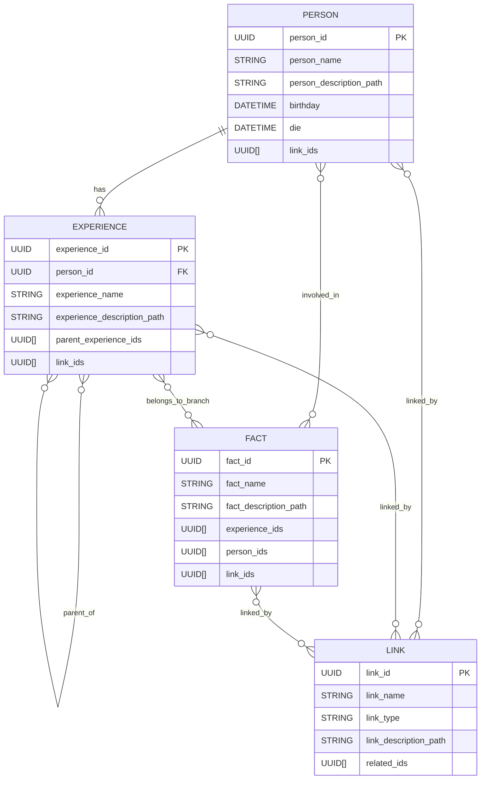

# HASM Model Database Structure

## HASM Model
HASM model consists of following components.

### Storage Model

```
my.hasm/
  |-- hasm.db
  |-- EXPERIENCE/
  |   `-- {UUID}/
  |       |-- main.md (HASM Markdown)
  |       `-- assets/ (HASM Markdown)
  |-- FACT/
  |   `-- {UUID}/
  |       |-- main.md (HASM Markdown)
  |       `-- assets/ (HASM Markdown)
  |-- LINK/
  |   `-- {UUID}/
  |       |-- main.md (HASM Markdown)
  |       `-- assets/ (HASM Markdown)
  `-- PERSON/
      `-- {UUID}/
          |-- main.md (HASM Markdown)
          `-- assets/ (HASM Markdown)
```
### DB Model
HASM have following models include following structures.



* PERSON
* EXPERIENCE
* FACT
* LINK

### PERSON
This information is kind of account for future SNS plan. This include each person's information.

* PERSON ID (UUID)
* PERSON Name (String)
* PERSON description (String: Path to HASM Markdown)
* Birthday (Datetime)
* Die (Datetime)
* LINK ID (List of UUID)

### EXPERIENCE
This is the branch in Git. However, HASM does not need uniequness. 

* EXPERIENCE ID (UUID)
* PERSON ID (UUID)
* EXPERIENCE Name (String)
* EXPERIENCE description (String: Path to HASM Markdown)
* Parent EXPERIENCE ID (List of UUID)
* LINK ID (List of UUID)

### FACT
This is the commit in GIT. This include fact which actually happen.

* FACT ID (UUID)
* FACT Name (String)
* EXPERIENCE ID (List of UUID)
* PERSON ID (List of UUID)
* FACT description (String: Path to HASM Markdown)
* LINK ID (List of UUID)

### LINK
Link represent relationship among PEOPLE, EXPERIENCE, and FACT.

* LINK ID (UUID)
* LINK Name (String)
* LINK Type (String)
* Related ID (List of UUID)
* Link description (String: Path to HASM Markdown)


