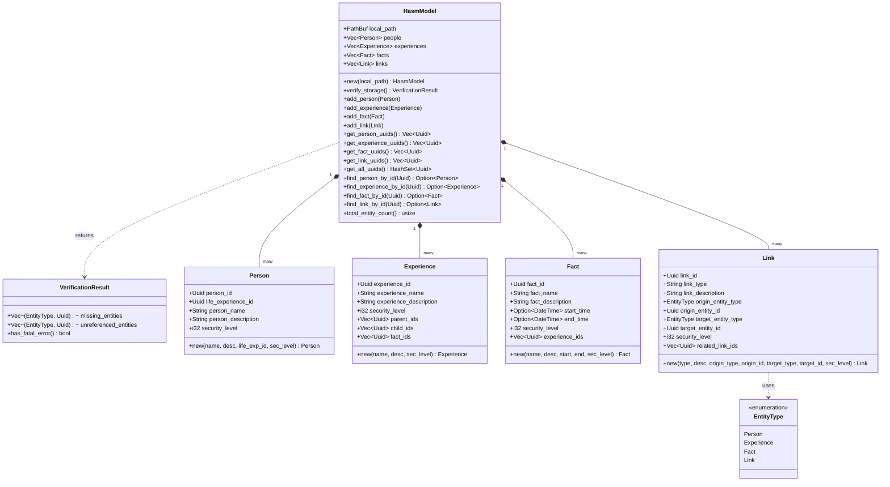

# HASM Model Database Structure

## HASM Model

HASM model consists of following entities.

* **PERSON**
* **EXPERIENCE**
* **FACT**
* **LINK**

HASM model independently keeps the information of each entities. However, metadata is also importatnt to keep the model structure. Therefore, the data is kept in local as Folder structure and database like below.

* Markdown and the assets to explain each entity will become huge and need to edit without GUI app. Therefore, this will keep as low text data. This will also helps to track the change on Git.
* The metadata for establishing HASM model will be included in hasm.db

### Storage Model

The markdowns which explain the detail of each entities are stored as local text file which can be editable by popular editor. This also helps to track the change by Git.

```
my.hasm/
  |-- hasm.db
  |-- EXPERIENCE/
  |   `-- {UUID}/
  |       |-- main.md (HASM Markdown)
  |       `-- assets/ (HASM Markdown)
  |-- FACT/
  |   `-- {UUID}/
  |       |-- main.md (HASM Markdown)
  |       `-- assets/ (HASM Markdown)
  |-- LINK/
  |   `-- {UUID}/
  |       |-- main.md (HASM Markdown)
  |       `-- assets/ (HASM Markdown)
  `-- PERSON/
      `-- {UUID}/
          |-- main.md (HASM Markdown)
          `-- assets/ (HASM Markdown)

```

### DB Model

The metadata which establish the HASM model will be stored in database model. To support the connection between each entities, following tables are added.

* **EXPERIENCE_TREE**
* **FACT_EXPERIENCE**
* **LINK_RELATION**

```mermaid
erDiagram
  PERSON {
    UUID person_id PK
    UUID life_experience_id
    STRING person_name
    STRING person_description
    INT security_level
  }

  EXPERIENCE {
    UUID experience_id PK
    STRING experience_name
    STRING experience_description
    INT security_level
  }

  EXPERIENCE_TREE {
      UUID parent_id PK "EXPERIENCE.experience_id"
      UUID child_id PK "EXPERIENCE.experience_id"
  }

  FACT {
    UUID fact_id PK
    STRING fact_name
    STRING fact_description
    DATETIME start_time
    DATETIME end_time
    INT security_level
  }

  FACT_EXPERIENCE {
      UUID fact_id PK "FACT.fact_id"
      UUID experience_id PK "EXPERIENCE.experience_id"
  }

  LINK {
    UUID link_id PK
    STRING link_type
    STRING link_description
    STRING origin_entity_type "PERSON | EXPERIENCE | FACT"
    UUID origin_entity_id
    STRING target_entity_type "PERSON | EXPERIENCE | FACT"
    UUID target_entity_id
    INT security_level
  }

  LINK_RELATION {
    UUID link_id PK "LINK.link_id"
    UUID related_link_id PK "LINK.link_id"
  }

  PERSON ||--|| EXPERIENCE : "has"
  EXPERIENCE ||--o{ EXPERIENCE_TREE : "parent"
  EXPERIENCE ||--o{ EXPERIENCE_TREE : "child"
  FACT ||--o{ FACT_EXPERIENCE : "belongs to"
  EXPERIENCE ||--o{ FACT_EXPERIENCE : "contains"
  PERSON ||..o{ LINK : "origin/target"
  EXPERIENCE ||..o{ LINK : "origin/target"
  FACT ||..o{ LINK : "origin/target"
  LINK ||--o{ LINK_RELATION : "has_relation"

```



### PERSON

PERSON is basic unit of the HASM model. Each person has one mandatory branch **Life EXPERIENCE ID**

* **PERSON ID** (*UUID*)
* **Life EXPERIENCE ID** (*UUID*)
* **PERSON Name** (*String*)
* **PERSON description** (*String*)
* **Security Level** (*Int*)

### EXPERIENCE

#### EXPERIENCE

PERSON owns experience. The experience is the subjective grouping of the facts.

* **EXPERIENCE ID** (*UUID*)
* **EXPERIENCE Name** (*String*)
* **EXPERIENCE description** (*String*)
* **Security Level** (*Int*)

#### EXPERIENCE_TREE

Experiences are connected like a Git branch by using **Parent IDs** and **Child IDs**.

* **Parent ID** (*UUID*) : Which EXPERIENCE is the base of this EXPERIENCE (This is the beginning point of the branching)
* **Child ID** (*UUID*) : Which EXPERIENCE is affected by this branch (This is the end point of the branching)

### FACT

#### FACT

FACT is the information which actually happens.

* **FACT ID** (*UUID*)
* **FACT Name** (*String*)
* **FACT description** (*String*)
* **Start Time** (*Datetime*)
* **End Time** (*Datetime*)
* **Security Level** (*Int*)

#### FACT_EXPERIENCE

The FACT is connected on EXPERIENCE branch by using **EXPERIENCE IDs**. Then the fact is registered as someone's experience.

* **FACT ID** (*UUID*)
* **EXPERIENCE ID** (*UUID*)

### LINK

#### LINK

Link represent relationship among PEOPLE, EXPERIENCE, and FACT. Basically, a link represent the relationship between single entity and single entity by using **Origin Entity ID** and **Target Entity ID**.

* **LINK ID** (*UUID*)
* **LINK Type** (*String*)
* **Link description** (*String*)
* **Origin Entity ID** (*UUID*)
* **Target Entity ID** (*UUID*)

#### LINK_RELATION

If there is a against meaning link like "refer" and "is refered by", that is included in **Related LINK IDs**. This helps to delete the all relation which has same information. Between **LINK ID** and **Related LINK ID**, there is no direction information.

* **LINK ID** (*UUID*)
* **Related LINK ID** (*UUID*)

---

## Rust Domain Model Structure

While the relational database (`hasm.db`) uses junction tables (`EXPERIENCE_TREE`, `FACT_EXPERIENCE`, `LINK_RELATION`) to handle many-to-many relationships, the in-memory Rust Domain Model simplifies these connections by directly embedding ID lists (`Vec<Uuid>`) into each core entity struct.

This approach aligns perfectly with HASM concepts, eliminates relational mapping friction, and provides clean JSON serialization for the React frontend via Tauri IPC.

### Class Diagram



### Rust Struct Definitions

```rust
use serde::{Deserialize, Serialize};
use std::collections::HashSet;
use std::path::{Path, PathBuf};
use uuid::Uuid;
use chrono::{DateTime, Utc};

/// Storage verification result containing missing and unreferenced entity IDs
#[derive(Debug, Clone, Serialize, Deserialize, Default)]
pub struct VerificationResult {
    pub missing_entities: Vec<(EntityType, Uuid)>,
    pub unreferenced_entities: Vec<(EntityType, Uuid)>,
}

impl VerificationResult {
    pub fn has_fatal_error(&self) -> bool {
        !self.missing_entities.is_empty()
    }
}

/// Container struct representing the entire HASM Domain Model
#[derive(Debug, Clone, Serialize, Deserialize, Default)]
pub struct HasmModel {
    pub local_path: PathBuf, // ワークスペースの基底パス
    pub people: Vec<Person>,
    pub experiences: Vec<Experience>,
    pub facts: Vec<Fact>,
    pub links: Vec<Link>,
}

impl HasmModel {
    pub fn new(local_path: impl Into<PathBuf>) -> Self {
        Self {
            local_path: local_path.into(),
            ..Default::default()
        }
    }

    // ===================================================================
    // Storage Verification Method (Encapsulated Domain Logic)
    // ===================================================================

    /// Verifies that all loaded entities have corresponding local folders on disk,
    /// and checks for any unreferenced folders on disk.
    pub fn verify_storage(&self) -> VerificationResult {
        let mut result = VerificationResult::default();

        // 1. Verify PERSON folders
        for id in self.get_person_uuids() {
            let path = self.local_path.join("PERSON").join(id.to_string()).join("main.md");
            if !path.exists() {
                result.missing_entities.push((EntityType::Person, id));
            }
        }

        // 2. Verify EXPERIENCE folders
        for id in self.get_experience_uuids() {
            let path = self.local_path.join("EXPERIENCE").join(id.to_string()).join("main.md");
            if !path.exists() {
                result.missing_entities.push((EntityType::Experience, id));
            }
        }

        // 3. Verify FACT folders
        for id in self.get_fact_uuids() {
            let path = self.local_path.join("FACT").join(id.to_string()).join("main.md");
            if !path.exists() {
                result.missing_entities.push((EntityType::Fact, id));
            }
        }

        // 4. Verify LINK folders
        for id in self.get_link_uuids() {
            let path = self.local_path.join("LINK").join(id.to_string()).join("main.md");
            if !path.exists() {
                result.missing_entities.push((EntityType::Link, id));
            }
        }

        // 5. Scan unreferenced folders on disk against model.get_all_uuids()
        // (Implementation details: read dir and compare with HashSet)

        result
    }

    // ===================================================================
    // Entity Addition & Mutator Methods
    // ===================================================================

    pub fn add_person(&mut self, person: Person) { self.people.push(person); }
    pub fn add_experience(&mut self, experience: Experience) { self.experiences.push(experience); }
    pub fn add_fact(&mut self, fact: Fact) { self.facts.push(fact); }
    pub fn add_link(&mut self, link: Link) { self.links.push(link); }

    // ===================================================================
    // UUID List Extraction Methods
    // ===================================================================

    pub fn get_person_uuids(&self) -> Vec<Uuid> { self.people.iter().map(|p| p.person_id).collect() }
    pub fn get_experience_uuids(&self) -> Vec<Uuid> { self.experiences.iter().map(|e| e.experience_id).collect() }
    pub fn get_fact_uuids(&self) -> Vec<Uuid> { self.facts.iter().map(|f| f.fact_id).collect() }
    pub fn get_link_uuids(&self) -> Vec<Uuid> { self.links.iter().map(|l| l.link_id).collect() }

    pub fn get_all_uuids(&self) -> HashSet<Uuid> {
        let mut set = HashSet::new();
        set.extend(self.get_person_uuids());
        set.extend(self.get_experience_uuids());
        set.extend(self.get_fact_uuids());
        set.extend(self.get_link_uuids());
        set
    }

    // ===================================================================
    // Entity Lookup Methods
    // ===================================================================

    pub fn find_person_by_id(&self, id: Uuid) -> Option<&Person> { self.people.iter().find(|p| p.person_id == id) }
    pub fn find_experience_by_id(&self, id: Uuid) -> Option<&Experience> { self.experiences.iter().find(|e| e.experience_id == id) }
    pub fn find_fact_by_id(&self, id: Uuid) -> Option<&Fact> { self.facts.iter().find(|f| f.fact_id == id) }
    pub fn find_link_by_id(&self, id: Uuid) -> Option<&Link> { self.links.iter().find(|l| l.link_id == id) }

    pub fn total_entity_count(&self) -> usize {
        self.people.len() + self.experiences.len() + self.facts.len() + self.links.len()
    }
}

// ===================================================================
// Entity Implementations with Constructors (new)
// ===================================================================

#[derive(Debug, Clone, Serialize, Deserialize)]
pub struct Person {
    pub person_id: Uuid,
    pub life_experience_id: Uuid,
    pub person_name: String,
    pub person_description: String,
    pub security_level: i32,
}

impl Person {
    pub fn new(
        person_name: impl Into<String>,
        person_description: impl Into<String>,
        life_experience_id: Uuid,
        security_level: i32,
    ) -> Self {
        Self {
            person_id: Uuid::new_v4(), // 自動UUID発行
            life_experience_id,
            person_name: person_name.into(),
            person_description: person_description.into(),
            security_level,
        }
    }
}

#[derive(Debug, Clone, Serialize, Deserialize)]
pub struct Experience {
    pub experience_id: Uuid,
    pub experience_name: String,
    pub experience_description: String,
    pub security_level: i32,
    pub parent_ids: Vec<Uuid>,
    pub child_ids: Vec<Uuid>,
    pub fact_ids: Vec<Uuid>,
}

impl Experience {
    pub fn new(
        experience_name: impl Into<String>,
        experience_description: impl Into<String>,
        security_level: i32,
    ) -> Self {
        Self {
            experience_id: Uuid::new_v4(),
            experience_name: experience_name.into(),
            experience_description: experience_description.into(),
            security_level,
            parent_ids: Vec::new(),
            child_ids: Vec::new(),
            fact_ids: Vec::new(),
        }
    }
}

#[derive(Debug, Clone, Serialize, Deserialize)]
pub struct Fact {
    pub fact_id: Uuid,
    pub fact_name: String,
    pub fact_description: String,
    pub start_time: Option<DateTime<Utc>>,
    pub end_time: Option<DateTime<Utc>>,
    pub security_level: i32,
    pub experience_ids: Vec<Uuid>,
}

impl Fact {
    pub fn new(
        fact_name: impl Into<String>,
        fact_description: impl Into<String>,
        start_time: Option<DateTime<Utc>>,
        end_time: Option<DateTime<Utc>>,
        security_level: i32,
    ) -> Self {
        Self {
            fact_id: Uuid::new_v4(),
            fact_name: fact_name.into(),
            fact_description: fact_description.into(),
            start_time,
            end_time,
            security_level,
            experience_ids: Vec::new(),
        }
    }
}

#[derive(Debug, Clone, Copy, PartialEq, Eq, Serialize, Deserialize)]
pub enum EntityType {
    Person,
    Experience,
    Fact,
}

#[derive(Debug, Clone, Serialize, Deserialize)]
pub struct Link {
    pub link_id: Uuid,
    pub link_type: String,
    pub link_description: String,
    pub origin_entity_type: EntityType,
    pub origin_entity_id: Uuid,
    pub target_entity_type: EntityType,
    pub target_entity_id: Uuid,
    pub security_level: i32,
    pub related_link_ids: Vec<Uuid>,
}

impl Link {
    pub fn new(
        link_type: impl Into<String>,
        link_description: impl Into<String>,
        origin_entity_type: EntityType,
        origin_entity_id: Uuid,
        target_entity_type: EntityType,
        target_entity_id: Uuid,
        security_level: i32,
    ) -> Self {
        Self {
            link_id: Uuid::new_v4(),
            link_type: link_type.into(),
            link_description: link_description.into(),
            origin_entity_type,
            origin_entity_id,
            target_entity_type,
            target_entity_id,
            security_level,
            related_link_ids: Vec::new(),
        }
    }
}
