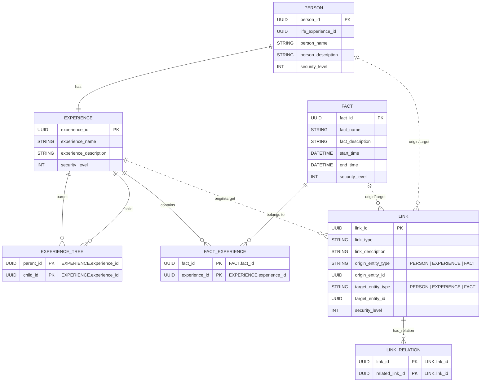

# HASM Model Database Structure

## HASM Model
HASM model consists of following entities.

* **PERSON**
* **EXPERIENCE**
* **FACT**
* **LINK**

HASM model independently keeps the information of each entities. However, metadata is also importatnt to keep the model structure. Therefore, the data is kept in local as Folder structure and database like below.

* Markdown and the assets to explain each entity will become huge and need to edit without GUI app. Therefore, this will keep as low text data. This will also helps to track the change on Git.
* The metadata for establishing HASM model will be included in hasm.db

### Storage Model
The markdowns which explain the detail of each entities are stored as local text file which can be editable by popular editor. This also helps to track the change by Git.

```
my.hasm/
  |-- hasm.db
  |-- EXPERIENCE/
  |   `-- {UUID}/
  |       |-- main.md (HASM Markdown)
  |       `-- assets/ (HASM Markdown)
  |-- FACT/
  |   `-- {UUID}/
  |       |-- main.md (HASM Markdown)
  |       `-- assets/ (HASM Markdown)
  |-- LINK/
  |   `-- {UUID}/
  |       |-- main.md (HASM Markdown)
  |       `-- assets/ (HASM Markdown)
  `-- PERSON/
      `-- {UUID}/
          |-- main.md (HASM Markdown)
          `-- assets/ (HASM Markdown)
```

### DB Model
The metadata which establish the HASM model will be stored in database model. To support the connection between each entities, following tables are added.

* **EXPERIENCE_TREE**
* **FACT_EXPERIENCE**
* **LINK_RELATION**



### PERSON
PERSON is basic unit of the HASM model. Each person has one mandatory branch **Life EXPERIENCE ID**

* **PERSON ID** (*UUID*)
* **Life EXPERIENCE ID** (*UUID*)
* **PERSON Name** (*String*)
* **PERSON description** (*String*)
* **Security Level** (*Int*)

### EXPERIENCE
#### EXPERIENCE
PERSON owns experience. The experience is the subjective grouping of the facts. 

* **EXPERIENCE ID** (*UUID*)
* **EXPERIENCE Name** (*String*)
* **EXPERIENCE description** (*String*)
* **Security Level** (*Int*)

#### EXPERIENCE_TREE
Experiences are connected like a Git branch by using **Parent IDs** and **Child IDs**.

* **Parent ID** (*UUID*) : Which EXPERIENCE is the base of this EXPERIENCE (This is the beginning point of the branching)
* **Child ID** (*UUID*) : Which EXPERIENCE is affected by this branch (This is the end point of the branching)

### FACT
#### FACT
FACT is the information which actually happens. 

* **FACT ID** (*UUID*)
* **FACT Name** (*String*)
* **FACT description** (*String*)
* **Start Time** (*Datetime*)
* **End Time** (*Datetime*)
* **Security Level** (*Int*)

#### FACT_EXPERIENCE
The FACT is connected on EXPERIENCE branch by using **EXPERIENCE IDs**. Then the fact is registered as someone's experience.

* **FACT ID** (*UUID*)
* **EXPERIENCE ID** (*UUID*)

### LINK
#### LINK
Link represent relationship among PEOPLE, EXPERIENCE, and FACT. Basically, a link represent the relationship between single entity and single entity by using **Origin Entity ID** and **Target Entity ID**. 

* **LINK ID** (*UUID*)
* **LINK Type** (*String*)
* **Link description** (*String*)
* **Origin Entity ID** (*UUID*)
* **Target Entity ID** (*UUID*)

#### LINK_RELATION
If there is a against meaning link like "refer" and "is refered by", that is included in **Related LINK IDs**. This helps to delete the all relation which has same information. Between **LINK ID** and **Related LINK ID**, there is no direction information.

* **LINK ID** (*UUID*)
* **Related LINK ID** (*UUID*)