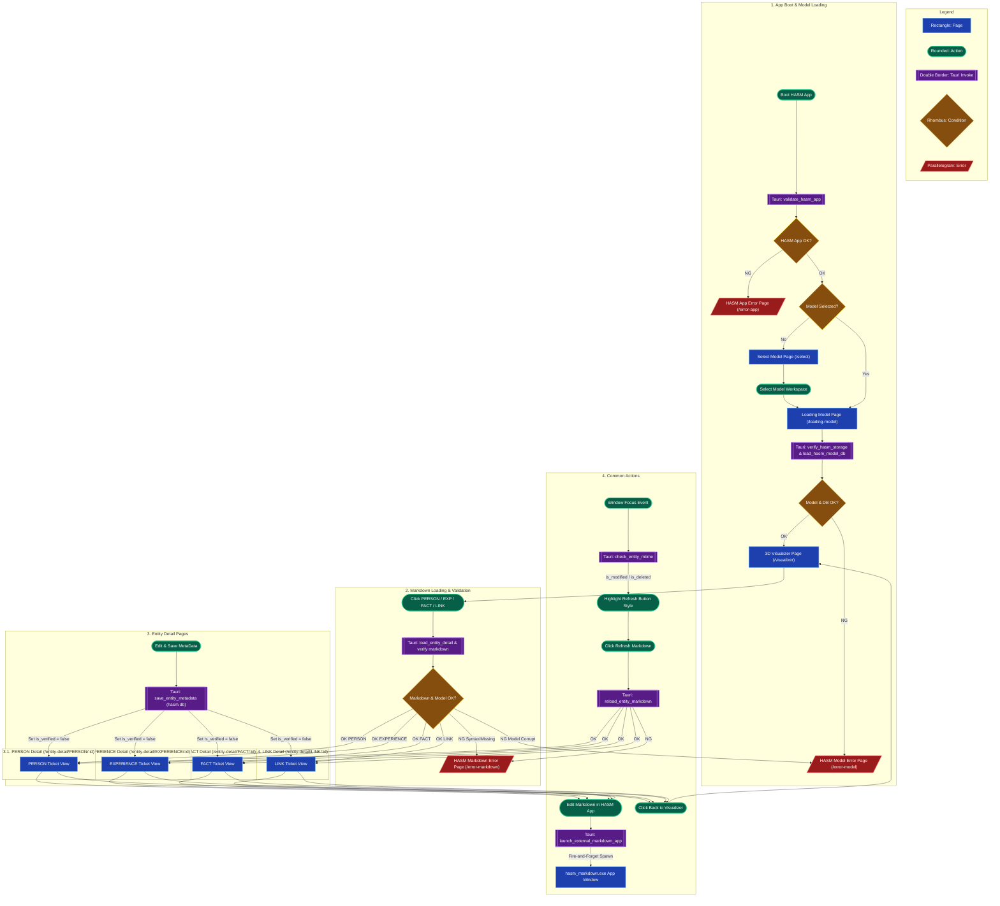

# System Overview with Screen Flow & React Architecture

This document explains the screen flow design, sequence mapping, React routing, and state architecture across the application lifecycle.

## 1. System Overview Flowchart



---

## 2. React Routing Architecture (React Router v6)

The React application uses declarative routing mapped directly to the sequence diagrams and lifecycle phases.

| Route Path | Page Component | Sequence Ref | Purpose & Description |
| --- | --- | --- | --- |
| `/` | `AppBootGate.tsx` | `SEQ-01` | Initial entry gate. Triggers `validate_hasm_app` and redirects to `/select` or `/loading-model`. |
| `/select` | `SelectModelPage.tsx` | `SEQ-02` | Workspace selector interface when no active model is selected or when changing models. |
| `/loading-model` | `LoadingModelPage.tsx` | `SEQ-02` | Progress & verification view. Executes `verify_hasm_storage` & `load_hasm_model_db`. |
| `/visualizer` | `VisualizerPage.tsx` | `SEQ-03` | Three.js 3D graph view. Intercepted by Guards if `HasmModel` is missing or `is_verified == false`. |
| `/entity-detail/:entity_type/:entity_id` | `EntityDetailPage.tsx` | `SEQ-04` | JIRA-style detail ticket view for PERSON, EXPERIENCE, FACT, and LINK entities. |
| `/error-app` | `ErrorAppPage.tsx` | `SEQ-06` | Fallback screen for binary/OS dependency initialization errors. |
| `/error-model` | `ErrorModelPage.tsx` | `SEQ-06` | Fallback screen for `hasm.db` corruption or workspace directory read errors. |
| `/error-markdown` | `ErrorMarkdownPage.tsx` | `SEQ-06` | Fallback screen for `main.md` syntax errors, timeouts, or file missing exceptions. |

---

## 3. React State Architecture

To maintain performance, non-blocking UI interactions, and single-source-of-truth across IPC calls, React state is divided into **Global Application State** (Context/Zustand) and **Local Component State**.

### 3.1 Global State (Workspace & Navigation Scope)

```typescript
interface GlobalHasmState {
  // Active Workspace Model Info
  activeModelPath: string | null;
  isModelLoaded: boolean;
  isVerified: boolean; // Corresponds to Rust In-Memory HasmModel.is_verified

  // System Configuration (SEQ-01)
  appConfig: {
    hasmMarkdownBinPath: string;
    version: string;
  } | null;

  // Actions
  setActiveModelPath: (path: string) => void;
  invalidateVerification: () => void; // Sets isVerified = false
}

```

### 3.2 Local Form & Ticket State (`EntityDetailPage.tsx`)

```typescript
interface EntityDetailLocalState {
  // Entity Data
  metadata: EntityMeta | null;
  markdownBody: string;
  lastLoadedMtimeMs: number; // Used for window focus mtime comparison

  // Operation Loading Flags (Isolated UI Lock)
  isEntityLoading: boolean;     // Initial detail page load
  isEntitySaving: boolean;      // Save metadata to SQLite
  isMarkdownVerifying: boolean; // Reload/Refresh markdown verification

  // Form State Checking
  isDirty: boolean;             // True if user edited ticket input fields
  
  // External Modification Alerts (SEQ-04 Chapter 5)
  hasExternalChanges: boolean;  // True if mtime > lastLoadedMtimeMs (Amber style)
  isMarkdownDeleted: boolean;   // True if main.md missing on disk (Red style)
}

```

---

## 4. Sequence Diagram Reference Index

Below is the complete index of architectural sequence specifications governing the React frontend, Tauri IPC, and Rust domain engine:

* [SEQ-01: App Launch & App Validation](./10-SEQ-01_AppLaunch_AppValidation.md)
* **Location:** `1. BootPhase` | **Tauri:** `validate_hasm_app`
* **Summary:** Application initialization, runtime binary existence checks, and environment setup.


* [SEQ-02: Model Loading](./11-SEQ-02_HASM_Model_Load.md)
* **Location:** `1. BootPhase` | **Tauri:** `verify_hasm_storage`, `load_hasm_model_db`
* **Summary:** Workspace selection, directory structure validation, SQLite `hasm.db` loading, and model verification (`is_verified = true`).


* [SEQ-03: HASM 3D Visualizer & Graph Rendering](./12-SEQ-03_Visualizer.md)
* **Location:** `1. BootPhase` & `2. RoutingPhase` | **Tauri:** `compute_visualizer_layout`
* **Summary:** Rust-driven 3D layout calculation (`TimeScaleMode`), Three.js graph rendering, raycasting navigation, and state verification guards.


* [SEQ-04: Entity MetaData Editing & Saving](./13-SEQ-04_Entity_Editing.md)
* **Location:** `3. DetailPages` | **Tauri:** `load_entity_detail`, `save_entity_metadata`, `check_entity_mtime`, `reload_entity_markdown`
* **Summary:** Ticket view rendering, single-entity domain validation (`entity.verify()`), SQLite metadata persistence (5,000ms hard timeout with `ROLLBACK`), `is_verified = false` invalidation, non-blocking window focus `mtime`/deletion checks, and manual Markdown refresh.


* [SEQ-05: External Markdown App Invocation](./14-SEQ-05_Edit_on_HASM_Markdown.md)
* **Location:** `4. CommonActions` | **Tauri:** `launch_external_markdown_app`
* **Summary:** Non-blocking, Fire-and-Forget process spawning of `hasm_markdown.exe` targeting the entity UUID directory without locking main app state.


* [SEQ-06: Error Fallback & Recovery Flow](./15-SEQ-06_Error_Fallback.md)
* **Location:** Across all subgraphs | **Tauri:** Recovery re-verifications (`validate_hasm_app`, `reload_entity_markdown`, `exit_app`)
* **Summary:** Unified error screen handling (`/error-app`, `/error-model`, `/error-markdown`), user retry actions, repair triggers, and safe fallback routing.