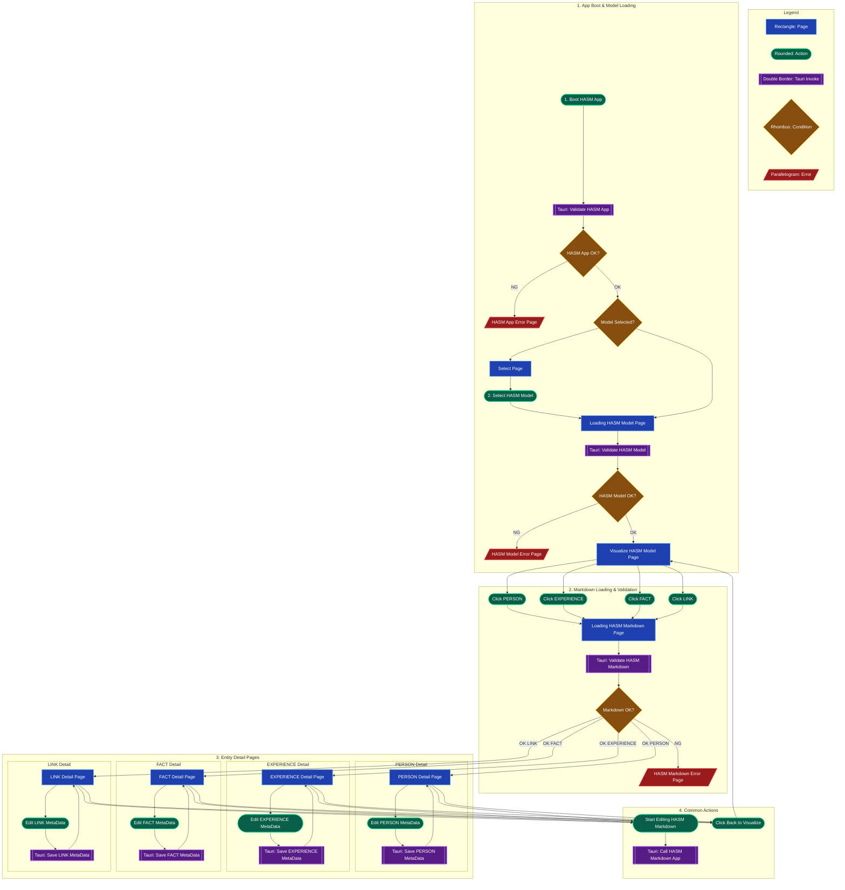

# System Overview with Screen Flow

This document explains the screen flow design.

## Overview

```mermaid
%%{
  init: {
    'theme': 'base',
    'themeVariables': {
      'fontFamily': 'inter, -apple-system, BlinkMacSystemFont, "Segoe UI", Roboto, sans-serif',
      'fontSize': '14px',
      'primaryColor': '#1e293b',
      'primaryTextColor': '#f8fafc',
      'primaryBorderColor': '#475569',
      'lineColor': '#64748b',
      'secondaryColor': '#334155',
      'tertiaryColor': '#0f172a',
      'clusterBkg': '#0f172a',
      'clusterBorder': '#334155',
      'edgeLabelBackground': '#1e293b'
    }
  }
}%%
flowchart TB
    %% Node Style Definitions
    classDef page fill:#1e40af,stroke:#60a5fa,stroke-width:1.5px,color:#ffffff;
    classDef error fill:#991b1b,stroke:#f87171,stroke-width:1.5px,color:#ffffff;
    classDef action fill:#065f46,stroke:#34d399,stroke-width:1.5px,color:#ffffff;
    classDef tauri fill:#581c87,stroke:#c084fc,stroke-width:1.5px,color:#ffffff;
    classDef cond fill:#854d0e,stroke:#facc15,stroke-width:1.5px,color:#ffffff;

    %% ----------------------------------------------------
    %% 0. Legend
    %% ----------------------------------------------------
    subgraph Legend["Legend"]
        direction LR
        L_Page[Rectangle: Page]:::page
        L_Action([Rounded: Action]):::action
        L_Tauri[[Double Border: Tauri Invoke]]:::tauri
        L_Cond{Rhombus: Condition}:::cond
        L_Error[/Parallelogram: Error/]:::error
    end

    %% ----------------------------------------------------
    %% 1. App Boot & Model Loading
    %% ----------------------------------------------------
    subgraph BootPhase["1. App Boot & Model Loading"]
        BootAction([1. Boot HASM App]):::action --> ValidateHASMApp[[Tauri: Validate HASM App]]:::tauri
        ValidateHASMApp --> AppCheck{HASM App OK?}:::cond
        
        AppCheck -->|NG| ErrorHASMApp[/HASM App Error Page/]:::error
        AppCheck -->|OK| DataSelectIF{Model Selected?}:::cond
        
        DataSelectIF --> SelectPage[Select Page]:::page
        SelectPage --> SelectModelAction([2. Select HASM Model]):::action
        SelectModelAction --> LoadingHASMModelPage[Loading HASM Model Page]:::page
        
        DataSelectIF --> LoadingHASMModelPage
        
        LoadingHASMModelPage --> ValidateHASMModel[[Tauri: Validate HASM Model]]:::tauri
        ValidateHASMModel --> ModelCheck{HASM Model OK?}:::cond
        
        ModelCheck -->|NG| ErrorHASMModel[/HASM Model Error Page/]:::error
        ModelCheck -->|OK| VisualizePage[Visualize HASM Model Page]:::page
    end

    %% ----------------------------------------------------
    %% 2. Entity Selection & Markdown Loading
    %% ----------------------------------------------------
    subgraph RoutingPhase["2. Markdown Loading & Validation"]
        VisualizePage --> ClickPerson([Click PERSON]):::action
        VisualizePage --> ClickExperience([Click EXPERIENCE]):::action
        VisualizePage --> ClickFact([Click FACT]):::action
        VisualizePage --> ClickLink([Click LINK]):::action

        ClickPerson --> LoadingMarkdownPage[Loading HASM Markdown Page]:::page
        ClickExperience --> LoadingMarkdownPage
        ClickFact --> LoadingMarkdownPage
        ClickLink --> LoadingMarkdownPage

        LoadingMarkdownPage --> ValidateHASMMarkdown[[Tauri: Validate HASM Markdown]]:::tauri
        ValidateHASMMarkdown --> MarkdownCheck{Markdown OK?}:::cond
        
        MarkdownCheck -->|NG| ErrorHASMMarkdown[/HASM Markdown Error Page/]:::error
    end

    %% ----------------------------------------------------
    %% 3. Entity Detail Pages (Nested Subgraphs)
    %% ----------------------------------------------------
    subgraph DetailPages["3. Entity Detail Pages"]
        
        subgraph PersonDetail["PERSON Detail"]
            PD[PERSON Detail Page]:::page
            EditPersonMeta([Edit PERSON MetaData]):::action
            SavePersonMeta[[Tauri: Save PERSON MetaData]]:::tauri
            
            PD --> EditPersonMeta
            EditPersonMeta --> SavePersonMeta
            SavePersonMeta --> PD
        end

        subgraph ExpDetail["EXPERIENCE Detail"]
            ED[EXPERIENCE Detail Page]:::page
            EditExpMeta([Edit EXPERIENCE MetaData]):::action
            SaveExpMeta[[Tauri: Save EXPERIENCE MetaData]]:::tauri
            
            ED --> EditExpMeta
            EditExpMeta --> SaveExpMeta
            SaveExpMeta --> ED
        end

        subgraph FactDetail["FACT Detail"]
            FD[FACT Detail Page]:::page
            EditFactMeta([Edit FACT MetaData]):::action
            SaveFactMeta[[Tauri: Save FACT MetaData]]:::tauri
            
            FD --> EditFactMeta
            EditFactMeta --> SaveFactMeta
            SaveFactMeta --> FD
        end

        subgraph LinkDetail["LINK Detail"]
            LD[LINK Detail Page]:::page
            EditLinkMeta([Edit LINK MetaData]):::action
            SaveLinkMeta[[Tauri: Save LINK MetaData]]:::tauri
            
            LD --> EditLinkMeta
            EditLinkMeta --> SaveLinkMeta
            SaveLinkMeta --> LD
        end

        %% Direct connections from Markdown Check
        MarkdownCheck -->|OK PERSON| PD
        MarkdownCheck -->|OK EXPERIENCE| ED
        MarkdownCheck -->|OK FACT| FD
        MarkdownCheck -->|OK LINK| LD
    end

    %% ----------------------------------------------------
    %% 4. Common Actions
    %% ----------------------------------------------------
    subgraph CommonActions["4. Common Actions"]
        EditMarkdown([Start Editing HASM Markdown]):::action
        CallMarkdownApp[[Tauri: Call HASM Markdown App]]:::tauri
        BackToVisualize([Click Back to Visualize]):::action

        EditMarkdown --> CallMarkdownApp
    end

    %% Connect to Common Actions
    PD --> EditMarkdown
    ED --> EditMarkdown
    FD --> EditMarkdown
    LD --> EditMarkdown

    PD --> BackToVisualize
    ED --> BackToVisualize
    FD --> BackToVisualize
    LD --> BackToVisualize

    BackToVisualize --> VisualizePage
```

