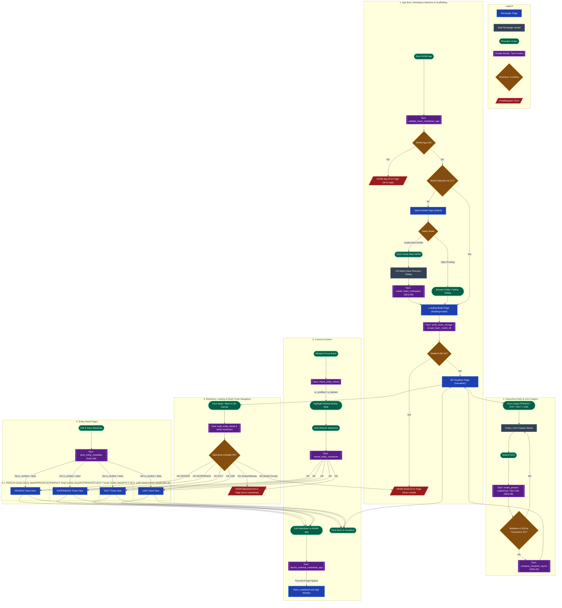

# System Overview with Screen Flow & React Architecture

This document explains the screen flow design, sequence mapping, React routing, state architecture, and complete CRUD / graph-binding lifecycle across the HASM Desktop Application (`hasm-desktop`).

---

## 1. System Overview Flowchart

---

## 2. React Routing Architecture (React Router v6)

The React application uses declarative routing mapped directly to sequence specifications and lifecycle phases.

| Route Path | Page Component / Modal | Sequence Ref | Purpose & Description |
| --- | --- | --- | --- |
| `/` | `AppBootGate.tsx` | `SEQ-01` | Initial entry gate. Triggers `validate_hasm_app` and redirects to `/select` or `/loading-model`. |
| `/select` | `SelectModelPage.tsx` | `SEQ-01`, `SEQ-08` | Workspace selector interface. Supports opening existing HASM models or scaffolding new workspaces via native OS Save Dialog. |
| `/loading-model` | `LoadingModelPage.tsx` | `SEQ-02` | Progress & verification view. Executes `verify_hasm_storage` & `load_hasm_model_db`. |
| `/visualizer` | `VisualizerPage.tsx` | `SEQ-03`, `SEQ-08` | Three.js 3D graph view. Includes Creation Toolbar (`Create PERSON`, `EXPERIENCE`, `FACT`, `LINK`) and handles graph re-layout. |
| `/entity-detail/:entity_type/:entity_id` | `EntityDetailPage.tsx` | `SEQ-04` | JIRA-style detail ticket view for PERSON, EXPERIENCE, FACT, and LINK entities. |
| `/error-app` | `ErrorAppPage.tsx` | `SEQ-06` | Fallback screen for binary/OS dependency initialization errors. |
| `/error-model` | `ErrorModelPage.tsx` | `SEQ-06` | Fallback screen for `hasm.db` corruption or workspace directory read errors. |
| `/error-markdown` | `ErrorMarkdownPage.tsx` | `SEQ-06` | Fallback screen for `main.md` syntax errors, timeouts, or file missing exceptions. |

---

## 3. Sequence Diagram Reference Index

Below is the complete index of architectural sequence specifications governing the React frontend, Tauri IPC, and Rust domain engine:

* [SEQ-01: App Launch & App Validation](https://www.google.com/search?q=./10-SEQ-01_AppLaunch_AppValidation.md)
* **Tauri:** `validate_hasm_markdown_app`, `validate_app_version`, `validate_hasm_folder_path`
* **Summary:** App launch, binary checks, CLI path resolution, and native OS folder/save dialog integration.

* [SEQ-02: Model Loading](https://www.google.com/search?q=./11-SEQ-02_HASM_Model_Load.md)
* **Tauri:** `check_workspace_lock`, `release_workspace_lock`, `verify_hasm_storage`, `load_hasm_model_db`
* **Summary:** Lock file verification, stale lock auto-recovery, `hasm.db` metadata loading, and storage verification.

* [SEQ-03: HASM 3D Visualizer & Dynamic Creation Controls](https://www.google.com/search?q=./12-SEQ-03_Visualizer.md)
* **Tauri:** `compute_visualizer_layout`
* **Summary:** 3D timeline layout computation (`TimeScaleMode`), Three.js graph rendering, creation toolbar triggers, and automatic 3D scene re-rendering.

* [SEQ-04: Entity MetaData Editing & Saving](https://www.google.com/search?q=./13-SEQ-04_Entity_Editing.md)
* **Tauri:** `load_entity_detail`, `save_entity_metadata`, `check_entity_mtime`, `reload_entity_markdown`
* **Summary:** Ticket view rendering, domain invariants (`entity.verify()`), SQLite metadata persistence, and window focus `mtime` detection.

* [SEQ-05: External Markdown App Invocation](https://www.google.com/search?q=./14-SEQ-05_Edit_on_HASM_Markdown.md)
* **Tauri:** `launch_external_markdown_app`
* **Summary:** Fire-and-Forget process spawning of `hasm_markdown.exe` targeting the entity UUID directory.

* [SEQ-06: Error Fallback & Recovery Flow](https://www.google.com/search?q=./15-SEQ-06_Error_Fallback.md)
* **Tauri:** Recovery re-verifications (`validate_hasm_app`, `reload_entity_markdown`, `repair_missing_entity_folders`)
* **Summary:** Unified error screens (`/error-app`, `/error-model`, `/error-markdown`), auto-repair folder creation, and recovery navigation.

* [SEQ-07: Global Navigation & Environment Management](https://www.google.com/search?q=./16-SEQ-07_Others.md)
* **Tauri:** `switch_workspace_cleanly`
* **Summary:** Global Navbar, clean workspace switching, 3-color palette customization, and route protection (Barrier 1).

* **[SEQ-08: Entity Creation & Link Graph Binding Sequence](https://www.google.com/search?q=./17-SEQ-08_Entity_Creation.md)**
* **Tauri:** `create_hasm_workspace`, `create_person`, `create_experience`, `create_fact`, `create_link`
* **Summary:** New workspace directory scaffolding, entity creation with UUID auto-generation, domain invariant checks (`entity.verify()`), atomic SQLite transactions, template `main.md` creation, and 3D graph binding.