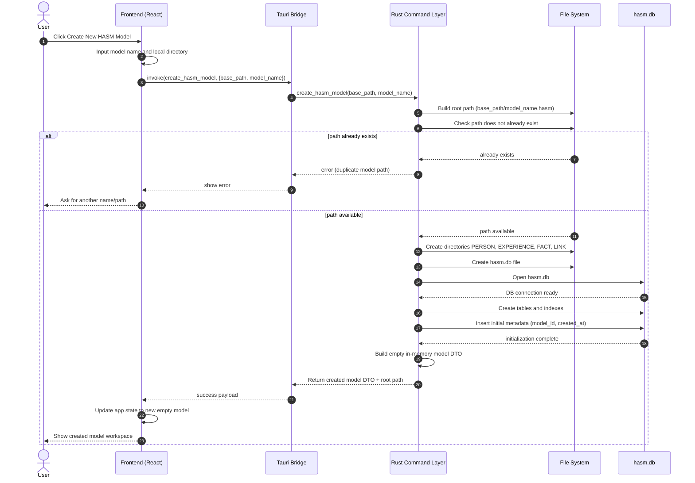

# Create New Local .hasm Model

This draft sequence diagram describes how HASM creates a new local model folder (for example, `my.hasm/`) using the structure defined in 00-hasm-model-structure.md.

## Notes

- Output is a local folder ending with .hasm.
- Initial folder layout contains hasm.db and top-level entity folders: PERSON, EXPERIENCE, FACT, LINK.
- Entity UUID subfolders and main.md files are created later when each entity is added.
