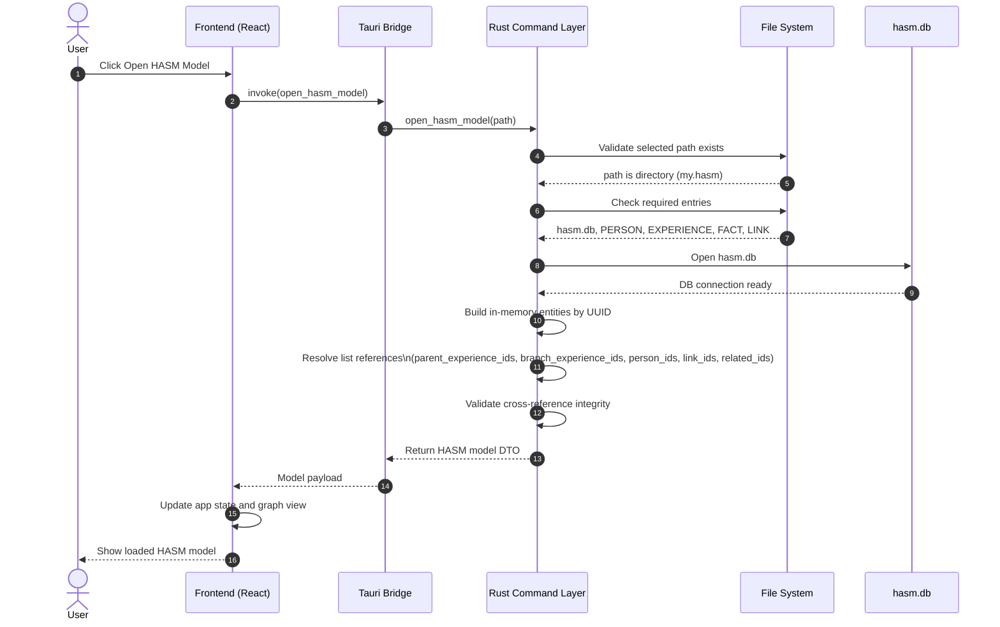

# Open Existing HASM Model

This draft sequence diagram describes how HASM opens an existing model folder (for example, `my.hasm/`) based on the storage and DB structure in `00-hasm-model-structure.md`.

## Notes

- Input path is expected to be a HASM model root directory, such as `my.hasm/`.
- `hasm.db` is opened first for model metadata/session integrity, then entity markdown is loaded from each category folder.
- IDs in list fields are resolved after all entities are loaded, to support forward references.
