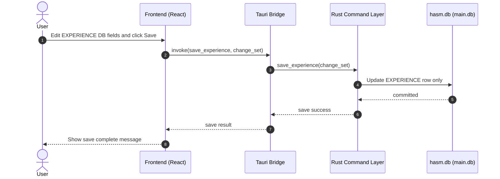
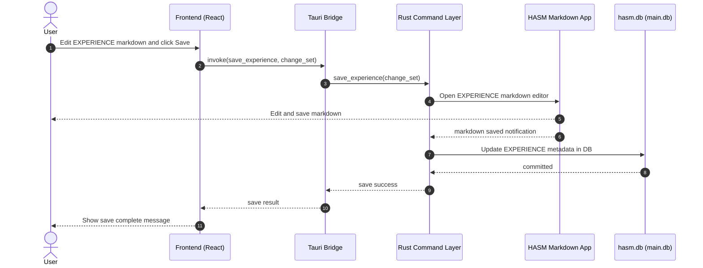
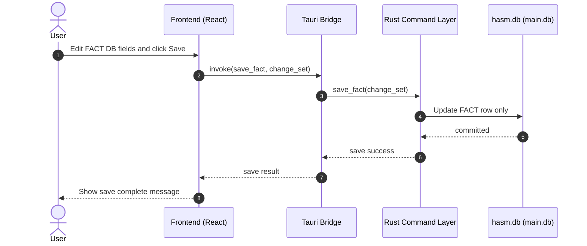
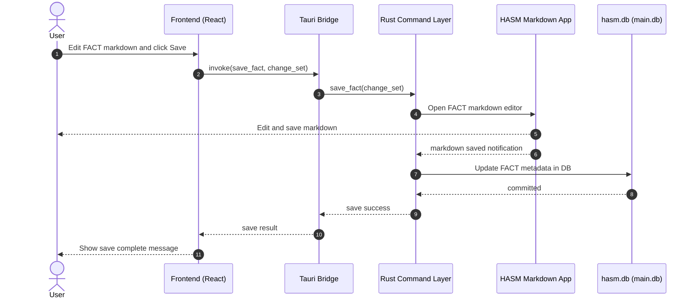
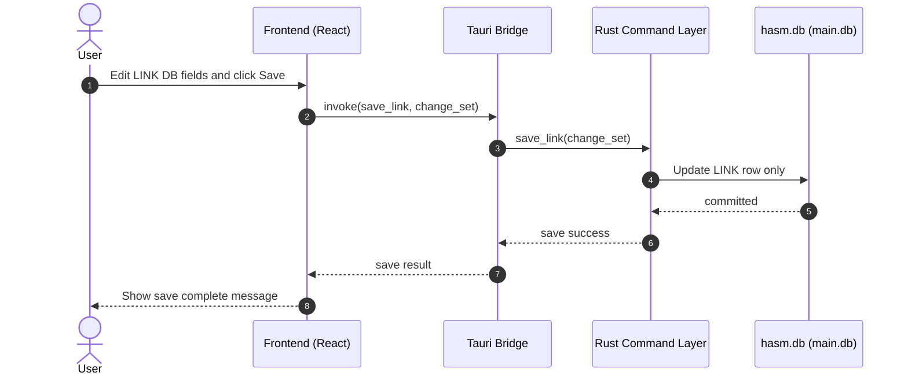
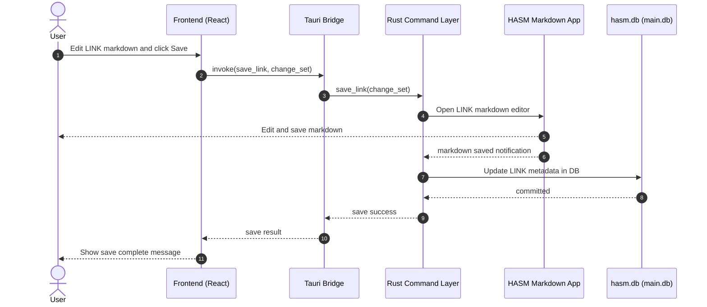

# Save HASM Model

This document describes save behavior split by edited part.

## Save Decision (Overview)

- EXPERIENCE
  - DB fields only: save to hasm.db (main.db) only.
  - HASM Markdown changed: open HASM Markdown App, edit, and save.
- FACT
  - DB fields only: save to hasm.db (main.db) only.
  - HASM Markdown changed: open HASM Markdown App, edit, and save.
- LINK
  - DB fields only: save to hasm.db (main.db) only.
  - HASM Markdown changed: open HASM Markdown App, edit, and save.

## EXPERIENCE Save

### EXPERIENCE: DB Fields Only

### EXPERIENCE: HASM Markdown Changed

## FACT Save

### FACT: DB Fields Only

### FACT: HASM Markdown Changed

## LINK Save

### LINK: DB Fields Only

### LINK: HASM Markdown Changed

## Notes

- This flow is scoped to EXPERIENCE, FACT, and LINK.
- DB-only changes do not open HASM Markdown App.
- Markdown changes always open HASM Markdown App before DB metadata update.
