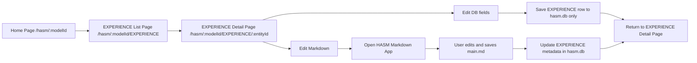
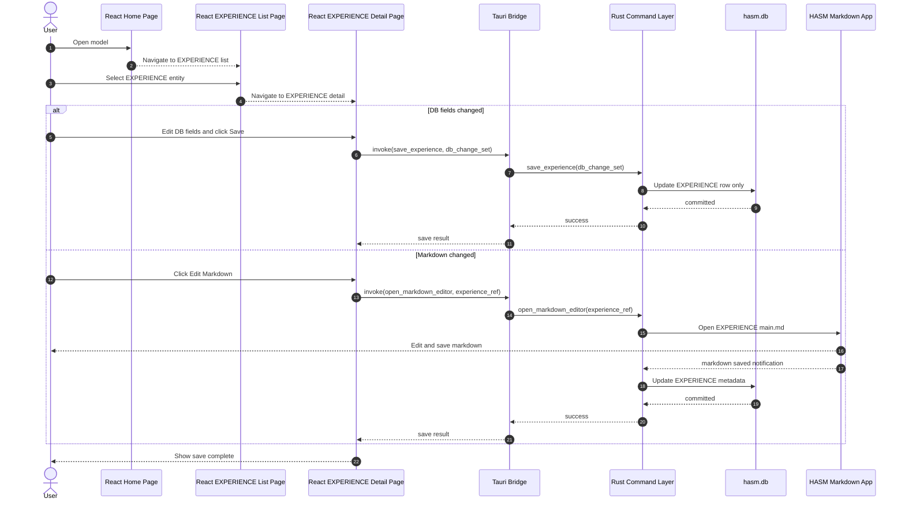
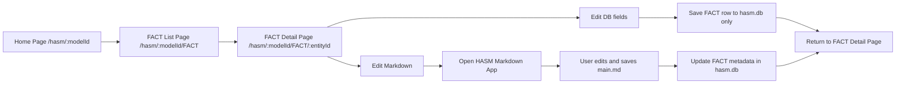
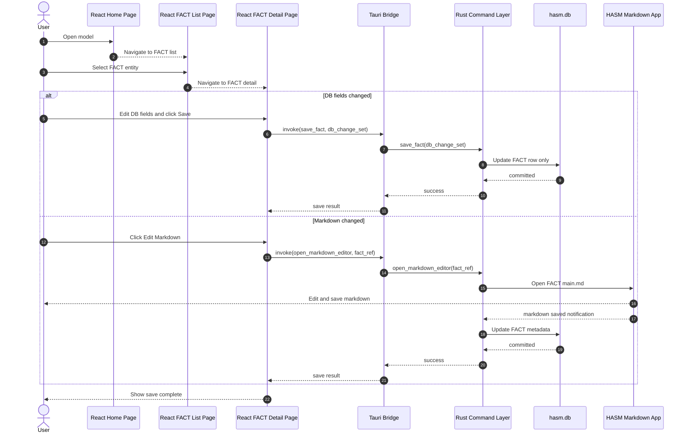
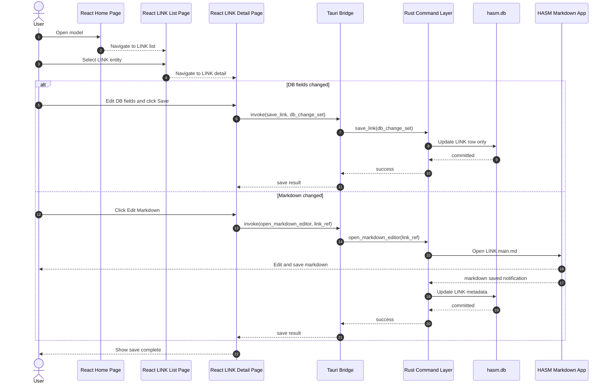

# Edit HASM Model (React Page Transfer)

This draft describes edit flow split by changed HASM part.
Each section shows React page transfer and save behavior.

## React Pages Required

- Model Home Page: `/hasm/:modelId`
- EXPERIENCE List Page: `/hasm/:modelId/EXPERIENCE`
- FACT List Page: `/hasm/:modelId/FACT`
- LINK List Page: `/hasm/:modelId/LINK`
- EXPERIENCE Detail Page: `/hasm/:modelId/EXPERIENCE/:entityId`
- FACT Detail Page: `/hasm/:modelId/FACT/:entityId`
- LINK Detail Page: `/hasm/:modelId/LINK/:entityId`

## EXPERIENCE Edit Flow

### EXPERIENCE Sequence

## FACT Edit Flow

### FACT Sequence

## LINK Edit Flow

### LINK Sequence

## Notes

- This page is split by changed part: EXPERIENCE, FACT, and LINK.
- Each flow includes React page transfer: Home -> List -> Detail.
- DB-only edit saves to hasm.db only.
- Markdown edit opens HASM Markdown App, then updates metadata in hasm.db.
