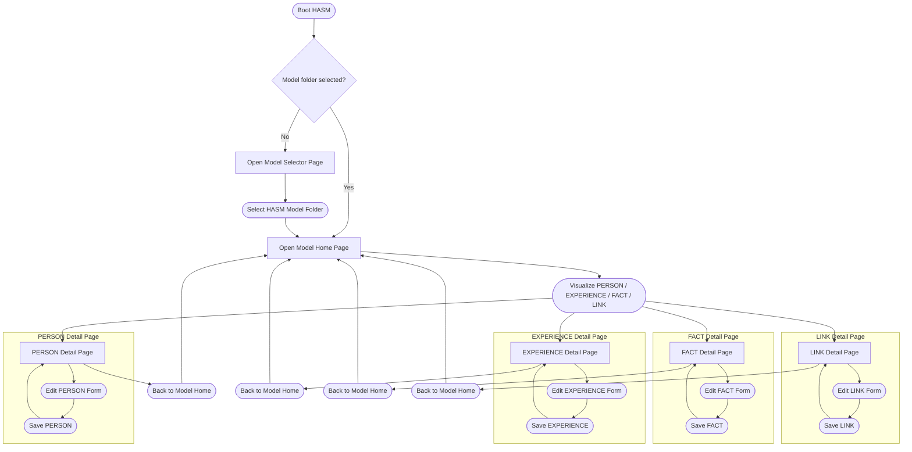

# Frontend HASM Model Page Transfer Architecture

This document describes frontend page transfer flow for HASM model operations.
It focuses on how users navigate between bootstrap, model selection, model home visualization, and each entity detail page.

## Page Transfer Flow

## Notes

- This flow is focused on page navigation and transfer between frontend pages.
- Model Home includes visualization for PERSON, EXPERIENCE, FACT, and LINK, and users open details directly from that visualization.
- Entity detail pages provide see, edit, and save operations in-page, then users can navigate back to Model Home.
- The architecture can be mapped to router paths such as `/`, `/open`, `/entity/:type/:id`, and `/visualize` if visualization is later reintroduced.
