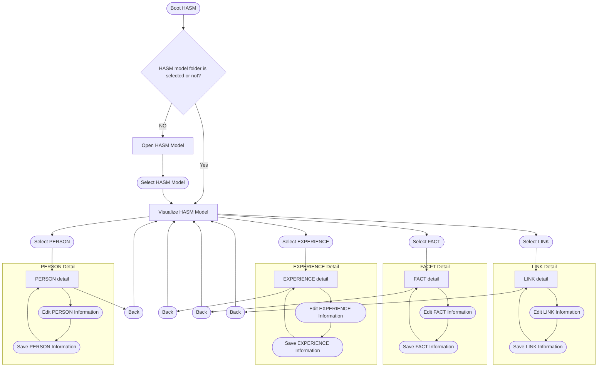

# Visualize HASM Model (3D Git-like Graph)

This draft describes a visualization concept similar to a 3D Git commit graph.
In this view, `EXPERIENCE` behaves like branches, `FACT` behaves like commits, and `LINK` behaves like cross-entity relationship edges.

## Visualization Pipeline

## Notes

- Mermaid is 2D, so this is a conceptual draft for a future 3D implementation.
- Suggested 3D mapping:
  - X-axis: timeline/order of FACTs
  - Y-axis: EXPERIENCE branch separation
  - Z-axis: entity type layers (PERSON, EXPERIENCE, FACT, LINK)
- Dashed edges represent non-branch references (PERSON/LINK relations).
