# SEQ-01: App Launch, Validation, and Workspace Creation/Selection (Architecture Sequence)

This document details the complete sequence for application startup, binary validation, CLI/Context Menu path resolution, manual folder selection, and launching the new HASM workspace scaffolding flow (`SEQ-08`).

---

## 1. Sequence Overview & Key Operations

1. **External App & Version Validation:** Validates `hasm_markdown.exe` binary existence, checks app version, and parses CLI arguments (`--path`).

2. **Path Verification:** Checks physical directory existence when launched via CLI/Context Menu.

3. **Workspace Selection (Open Existing):** Provides manual workspace selection via debounced input or native OS directory dialog.

4. **Workspace Creation Entry Point (Create New):** Triggers the native OS save dialog to specify a target directory path (e.g. `/path/to/MyLife.hasm`), handing off execution to `create_hasm_workspace` (`SEQ-08`).

---

## 2. Sequence Diagram

```mermaid
sequenceDiagram
    autonumber
    actor User as User / OS
    participant React as React (App.tsx / SelectPage)
    participant Dialog as OS Native File Dialog
    participant Router as React Router
    participant Bridge as Tauri IPC Bridge
    participant Rust as Rust Command (main.rs / model_commands.rs)
    participant FS as File System / OS

    User->>React: Launch Application (via exe, CLI --path, or Context Menu)
    React->>React: Set Initial Loading State<br/>{ isLoading: true, loadState: 0, error: null }

    %% ----------------------------------------------------
    %% Check 1: External Markdown App Validation
    %% ----------------------------------------------------
    rect rgb(15, 23, 42)
        Note over React,Rust: Check 1: Validate External HASM Markdown App
        React->>Bridge: invoke('validate_hasm_markdown_app')
        Bridge->>Rust: IPC: validate_hasm_markdown_app()
        
        Rust->>Rust: Execute test invocation / check executable path

        break On IPC Timeout (>5000ms) OR Validation Error (Result::Err)
            Rust-->>Bridge: Return Err(AppValidationError { code: "ERR_MARKDOWN_APP_INVALID" })
            Bridge-->>React: Reject Promise (AppValidationError)
            React->>React: Set State: { error: err.message, isLoading: false }
            React->>Router: navigate('/error-app')
            Note over React,Router: Display HASM App Error Page
        end

        Rust-->>Bridge: Return Ok(())
        Bridge-->>React: Resolve Promise
        React->>React: Set State: { loadState: 1 }
    end

    %% ----------------------------------------------------
    %% Check 2: App Version & Launch Arguments Inspection
    %% ----------------------------------------------------
    rect rgb(15, 23, 42)
        Note over React,Rust: Check 2: Inspect App Version & CLI Arguments
        React->>Bridge: invoke('validate_app_version')
        Bridge->>Rust: IPC: validate_app_version()
        
        Rust->>Rust: Read env!("CARGO_PKG_VERSION") & Parse std::env::args()
        
        break On Inspection Error (Result::Err)
            Rust-->>Bridge: Return Err(AppValidationError { code: "ERR_VERSION_CHECK_FAILED" })
            Bridge-->>React: Reject Promise (AppValidationError)
            React->>React: Set State: { error: err.message, isLoading: false }
            React->>Router: navigate('/error-app')
            Note over React,Router: Display HASM App Error Page
        end

        Rust-->>Bridge: Return Ok(AppVersionResponse { isModelSelected: boolean, path: Option<String> })
        Bridge-->>React: Resolve Promise (payload)
        React->>React: Set State: { loadState: 2, modelPath: payload.path }
    end

    %% ----------------------------------------------------
    %% Check 3: Path Existence Verification (If CLI Argument Provided)
    %% ----------------------------------------------------
    rect rgb(15, 23, 42)
        Note over React,FS: Check 3: Verify Folder Path Existence (Only if CLI Path Provided)
        
        opt isModelSelected == true
            React->>Bridge: invoke('validate_hasm_folder_path', { path: modelPath })
            Bridge->>Rust: IPC: validate_hasm_folder_path(path)
            
            Rust->>FS: std::path::Path::new(&path).exists()
            FS-->>Rust: boolean (Path Existence)
            
            break On Path Not Found OR FS Timeout (>3000ms)
                Rust-->>Bridge: Return Err(AppValidationError { code: "ERR_TARGET_PATH_NOT_FOUND" })
                Bridge-->>React: Reject Promise (AppValidationError)
                React->>React: Set State: { error: "Specified HASM path does not exist", isModelSelected: false }
            end

            Rust-->>Bridge: Return Ok(())
            Bridge-->>React: Resolve Promise
            React->>Router: navigate('/loading-model', { state: { path: modelPath } })
            Note over React,Router: Direct Launch -> Proceed to SEQ-02
        end

        React->>React: Set State: { loadState: 3 }
    end

    %% ----------------------------------------------------
    %% Check 4: Workspace Selection OR Creation (SelectModelPage)
    %% ----------------------------------------------------
    rect rgb(15, 23, 42)
        Note over User,FS: Check 4: Manual Selection OR New Workspace Creation
        
        React->>React: Set State: { isLoading: false }
        React->>Router: navigate('/select')
        Note over React,Router: Display Select Model Page (/select)
        
        alt Mode A: Open Existing Workspace
            User->>React: Click "Browse Existing HASM Model"
            React->>Dialog: Trigger OS Open Directory Dialog
            Dialog-->>React: Return selectedDirectoryPath
            
            React->>Bridge: invoke('validate_hasm_folder_path', { path: selectedDirectoryPath })
            Bridge->>Rust: IPC: validate_hasm_folder_path(selectedDirectoryPath)
            Rust->>FS: Verify path and hasm.db existence
            
            alt Path Valid
                Rust-->>Bridge: Return Ok(())
                Bridge-->>React: Resolve Promise
                React->>Router: navigate('/loading-model', { state: { path: selectedDirectoryPath } })
                Note over React,Router: Proceed to SEQ-02
            else Path Invalid
                Rust-->>Bridge: Return Err(AppValidationError)
                Bridge-->>React: Reject Promise
                React->>React: Show Toast Error ("Invalid HASM Workspace Folder")
            end

        else Mode B: Create New HASM Model (Scaffolding Flow)
            User->>React: Click "Create New HASM Model"
            React->>Dialog: Trigger OS Save Directory Dialog
            User->>Dialog: Select Target Folder & Name (e.g. "/path/to/MyLife.hasm")
            
            alt User Cancels Dialog
                Dialog-->>React: Return Cancelled State
                React->>React: Remain on /select Page
            else Target Path Selected
                Dialog-->>React: Return targetDirectoryPath
                React->>Bridge: invoke('create_hasm_workspace', { targetDirectoryPath })
                Note over Bridge,Rust: Hand-off to SEQ-08 Chapter 1 (Scaffolding Sequence)
                Bridge-->>React: Resolve Promise (WorkspacePathPayload)
                React->>Router: navigate('/loading-model', { state: { path: targetDirectoryPath } })
                Note over React,Router: Proceed to SEQ-02
            end
        end
    end

```

