# SEQ-01: App Launch & App Validation (Detailed Specification)

This document details the startup and initialization flow for the HASM Desktop Application.
It ensures that external editor dependencies, application versions, launch parameters (CLI arguments), and file system paths are thoroughly validated before the user interfaces with the application.

## Sequence Diagram

```mermaid
sequenceDiagram
    autonumber
    actor User as User / OS
    participant React as React (App.tsx)
    participant Router as React Router
    participant Bridge as Tauri IPC Bridge
    participant Rust as Rust Command (main.rs)
    participant FS as File System / OS

    User->>React: Launch Application (via exe OR Context Menu)
    React->>React: Set Initial Loading State<br/>{ isLoading: true, loadState: 0, error: null }

    %% ----------------------------------------------------
    %% Check 1: External Markdown App Validation
    %% ----------------------------------------------------
    rect rgb(30, 41, 59)
        Note over React,Rust: Check 1: Validate External HASM Markdown App
        React->>Bridge: invoke('validate_hasm_markdown_app')
        Bridge->>Rust: IPC: validate_hasm_markdown_app()
        
        Rust->>Rust: Execute test invocation / check executable path

        break On IPC Timeout (>5000ms) OR Validation Error (Result::Err)
            Rust-->>Bridge: Return Err(AppValidationError { code: "ERR_MARKDOWN_APP_INVALID" })
            Bridge-->>React: Reject Promise (AppValidationError)
            React->>React: Set State: { error: err.message, isLoading: false }
            React->>Router: navigate('/error-app')
            Note over React,Router: Display HASM App Error Page
        end

        Rust-->>Bridge: Return Ok(())
        Bridge-->>React: Resolve Promise
        React->>React: Set State: { loadState: 1 }
    end

    %% ----------------------------------------------------
    %% Check 2: App Version & Launch Arguments Inspection
    %% ----------------------------------------------------
    rect rgb(30, 41, 59)
        Note over React,Rust: Check 2: Inspect App Version & CLI Arguments
        React->>Bridge: invoke('validate_app_version')
        Bridge->>Rust: IPC: validate_app_version()
        
        Rust->>Rust: Read env!("CARGO_PKG_VERSION") & Parse std::env::args()
        
        break On Inspection Error (Result::Err)
            Rust-->>Bridge: Return Err(AppValidationError { code: "ERR_VERSION_CHECK_FAILED" })
            Bridge-->>React: Reject Promise (AppValidationError)
            React->>React: Set State: { error: err.message, isLoading: false }
            React->>Router: navigate('/error-app')
            Note over React,Router: Display HASM App Error Page
        end

        Rust-->>Bridge: Return Ok(AppVersionResponse { isModelSelected: boolean, path: Option<String> })
        Bridge-->>React: Resolve Promise (payload)
        React->>React: Set State: { loadState: 2, modelPath: payload.path }
    end

    %% ----------------------------------------------------
    %% Check 3: Path Existence Verification (If Path Provided)
    %% ----------------------------------------------------
    rect rgb(30, 41, 59)
        Note over React,FS: Check 3: Verify Folder Path Existence (Only if isModelSelected == true)
        
        opt isModelSelected == true
            React->>Bridge: invoke('validate_hasm_folder_path', { path: modelPath })
            Bridge->>Rust: IPC: validate_hasm_folder_path(path)
            
            Rust->>FS: std::path::Path::new(&path).exists()
            FS-->>Rust: boolean (Path Existence)
            
            break On Path Not Found OR FS Timeout (>3000ms)
                Rust-->>Bridge: Return Err(AppValidationError { code: "ERR_TARGET_PATH_NOT_FOUND" })
                Bridge-->>React: Reject Promise (AppValidationError)
                React->>React: Set State: { error: "Specified HASM path does not exist", isLoading: false }
                React->>Router: navigate('/error-app')
                Note over React,Router: Display HASM App Error Page (Invalid Path)
            end

            Rust-->>Bridge: Return Ok(())
            Bridge-->>React: Resolve Promise
        end

        React->>React: Set State: { loadState: 3, isAppValid: true }
    end

    %% ----------------------------------------------------
    %% Final Routing
    %% ----------------------------------------------------
    React->>React: Set State: { isLoading: false }
    
    alt Booted via Context Menu (Path exists & verified: isModelSelected == true)
        React->>Router: navigate('/loading-model', { state: { path: modelPath } })
        Note over React,Router: Skip Select Page -> Proceed directly to SEQ-02
    else Booted directly via exe (No path argument: isModelSelected == false)
        React->>Router: navigate('/select')
        Note over React,Router: Display Select Page for manual folder selection
    end

```



## Technical Specifications & Data Structures

### Data Contracts (Rust <-> React IPC)

```rust
// Error Payload returned by all validation commands
#[derive(Serialize, Deserialize, Debug)]
pub struct AppValidationError {
    pub code: String,    // e.g., "ERR_MARKDOWN_APP_INVALID", "ERR_TARGET_PATH_NOT_FOUND"
    pub message: String, // Human-readable error description
}

// Response structure for Check 2
#[derive(Serialize, Deserialize, Debug)]
pub struct AppVersionResponse {
    pub is_model_selected: bool,
    pub path: Option<String>,
    pub version: String,
}

```

## Detailed Step-by-Step Explanation

### Step 1: Initial Application Boot

* **Execution:** `React (App.tsx)`
* **Description:** When the application mounts, React sets its local/global initialization state to `{ isLoading: true, loadState: 0, error: null }`. This triggers an initial splash or loading spinner UI.

### Step 2: Check 1 - Validate External HASM Markdown App

* **Command:** `invoke('validate_hasm_markdown_app')`
* **Description:**
* React calls Rust to verify that the external HASM Markdown Application executable is present and callable on the host OS.
* **Timeout Constraint:** Managed within a 5,000ms threshold. If the external process hangs or fails to respond, it yields a `Result::Err`.
* **Error Handling:** On error, execution breaks immediately. React sets `isLoading: false`, stores the error message, and routes to `/error-app`.
* **Success:** React updates its progress state to `loadState: 1`.


### Step 3: Check 2 - Inspect App Version & CLI Arguments

* **Command:** `invoke('validate_app_version')`
* **Description:**
* Rust reads its package version (`CARGO_PKG_VERSION`) and inspects `std::env::args()`.
* If a folder path was passed via the File Explorer context menu (e.g., `hasm-app.exe "C:\path\to\hasm-folder"`), Rust parses this argument and sets `isModelSelected = true` with `path = Some("C:\\path\\to\\hasm-folder")`.
* If launched directly via executable without arguments, `isModelSelected` returns `false`.


* **Success:** React updates its progress state to `loadState: 2` and stores the retrieved `modelPath` in state/context.

### Step 4: Check 3 - Verify Folder Path Existence (Conditional)

* **Command:** `invoke('validate_hasm_folder_path', { path: modelPath })`
* **Condition:** Executed **ONLY** when `isModelSelected == true`.
* **Description:**
* Rust checks if the supplied path actually exists on the target disk (`std::path::Path::new(&path).exists()`).
* Note: This step solely checks disk existence; full HASM model schema parsing is deferred to `SEQ-02`.
* **Timeout Constraint:** Wrapped in a 3,000ms threshold to prevent UI freezes on unresponsive network drives.
* **Error Handling:** If the path was deleted or unreadable, a `break` is triggered, returning `ERR_TARGET_PATH_NOT_FOUND` and navigating to `/error-app`.


* **Success:** React updates its progress state to `{ loadState: 3, isAppValid: true }`.

### Step 5: Final Routing Decision

* **Execution:** `React Router`
* **Description:** Once all enabled checks complete successfully, `isLoading` is set to `false`.
* **Branch A (`isModelSelected == true`):** Navigates directly to `/loading-model`, passing `modelPath` via route state to initiate `SEQ-02: Model Selection & Loading`.
* **Branch B (`isModelSelected == false`):** Navigates to `/select` (`Select Page`), prompting the user to manually choose a HASM folder.
