# SEQ-02: Model Loading & Storage Verification (Architecture Sequence)

This document details the complete sequence for checking and managing workspace lock files (including stale lock auto-recovery and graceful release on window close), loading metadata from `hasm.db` into the `HasmModel` Rust domain class with granular progress streaming (`current`, `total`, `percentage`), Watchdog Timeout handling (Pattern B), and executing encapsulated storage verification via `model.verify_storage()`.

---

## 1. Data Contracts & Time Constraints

### 1.1 IPC Data Definitions (Rust / TypeScript Interface)

```rust
// Payload for check_workspace_lock command
#[derive(Debug, Serialize, Deserialize)]
pub struct CheckWorkspaceLockRequest {
    pub path: String,
}

// Response payload for check_workspace_lock
#[derive(Debug, Serialize, Deserialize)]
pub struct LockStatus {
    pub is_locked: bool,
    pub holder_pid: Option<u32>,
    pub is_stale_recovered: bool, // True if a stale lock file from a crashed PID was cleaned
    pub is_read_only: bool,
}

// Payload for release_workspace_lock command (invoked explicitly or on window close)
#[derive(Debug, Serialize, Deserialize)]
pub struct ReleaseWorkspaceLockRequest {
    pub path: String,
}

// Event payload for progress streaming
#[derive(Debug, Serialize, Deserialize)]
pub struct ProgressPayload {
    pub step: String, // "DB_LOAD" | "STORAGE_VERIFY"
    pub current: usize,
    pub total: usize,
    pub percentage: f32,
    pub message: String,
}

```

### 1.2 Time Constraints Policy Matrix

| Operation | Timeout Rule | Timeout Value | Timeout Action & Rollback |
| --- | --- | --- | --- |
| **Workspace Lock Check & Recovery** (`check_workspace_lock`) | Fixed Hard Timeout | **3,000 ms** | Fail lock acquisition; notify UI and navigate to `/error-model`. |
| **Database Load Stream** (`load_hasm_model_db`) | Watchdog Timer (Pattern B) | **10,000 ms** (Without event) | Terminate load attempt; reject IPC; navigate to `/error-model`. |
| **Storage Verification Stream** (`verify_hasm_storage`) | Watchdog Timer (Pattern B) | **10,000 ms** (Without event) | Abort verification; reject IPC; navigate to `/error-model`. |
| **Workspace Lock Release** (`release_workspace_lock`) | Window Close Sync Lock | **1,000 ms** | Force remove `.hasm/lock` file and terminate app process. |

---

## 2. Lock File Lifecycle & Stale Recovery Rules

1. **Active Lock Check:** When inspecting `.hasm/lock`, Rust reads the recorded Process ID (`holder_pid`).
2. **Stale Lock Auto-Recovery:** If the recorded `holder_pid` is no longer active in the OS process table (e.g., prior app crash or SIGKILL), Rust removes the stale lock file, logs the cleanup, and acquires a fresh lock (`is_stale_recovered = true`).
3. **Graceful Release on Window Close (Top-Right "X"):** Tauri's window `tauri://close-requested` event is intercepted. The app executes `release_workspace_lock` (deleting `.hasm/lock`) before exiting the desktop process.

---

## 3. Sequence Architecture Chapters

### Participant Lifecycle Legend

* **User**: End user interacting with `LoadingModelPage.tsx` or closing the application window.
* **React**: `LoadingModelPage.tsx` / `App.tsx` global event listener.
* **Router**: `React Router` navigation engine.
* **Bridge**: `Tauri IPC Bridge / listen()`.
* **Rust**: `model_loader.rs` in Rust backend.
* **Model**: `HasmModel` Rust Domain Instance.
* **FS**: Local File System / Workspace Storage (`.hasm/lock`, `hasm.db`).

---

### Chapter 1: Model Loading & Storage Verification Flow

```mermaid
sequenceDiagram
    autonumber
    participant User as User / OS
    participant React as React (LoadingModelPage.tsx)
    participant Router as React Router
    participant Bridge as Tauri IPC Bridge / listen()
    participant Rust as Rust Command (model_loader.rs)
    participant Model as HasmModel (Domain Instance)
    participant FS as File System / Workspace

    Note over User,FS: Pre-condition: Navigation from SEQ-01 completed. React receives modelPath via route state.

    React->>Bridge: Setup Event Listeners:<br/>listen('model-load-progress') & listen('model-verify-progress')
    React->>React: Mount Component & Set Initial State<br/>{ isModelLoading: true, modelProgress: 0, current: 0, total: 0, loadingMessage: "Initializing...", modelError: null }

    %% ----------------------------------------------------
    %% Step 1: Workspace Lock Check & Stale Lock Recovery
    %% ----------------------------------------------------
    rect rgb(15, 23, 42)
        Note over React,FS: Step 1: Check Workspace Lock File (Fixed 3,000ms Hard Timeout)
        React->>Bridge: invoke('check_workspace_lock', { path: modelPath })
        Bridge->>Rust: IPC: check_workspace_lock(path)
        
        Rust->>FS: Read .hasm/lock file
        
        break On Frontend Hard Timeout (>3,000ms without response)
            React->>React: Set State: { modelError: "Lock check timed out", isModelLoading: false }
            React->>Router: navigate('/error-model')
        end

        alt Lock file exists on disk
            FS-->>Rust: Return holder_pid (e.g., 5678)
            Rust->>Rust: Inspect OS Process Table for holder_pid
            
            alt holder_pid is DEAD (Stale Lock from previous crash)
                Rust->>FS: Remove stale .hasm/lock file
                Rust->>FS: Create new .hasm/lock with current PID
                Rust-->>Bridge: Return Ok(LockStatus { is_locked: false, holder_pid: current_pid, is_stale_recovered: true, is_read_only: false })
                Bridge-->>React: Resolve Promise
                React->>React: Set State: { isReadOnly: false } & Display Info Toast ("Recovered stale lock file")
            else holder_pid is ALIVE (Active process using workspace)
                Rust-->>Bridge: Return Ok(LockStatus { is_locked: true, holder_pid: 5678, is_stale_recovered: false, is_read_only: true })
                Bridge-->>React: Resolve Promise
                React->>React: Set State: { isReadOnly: true, warning: "Opened in Read-Only Mode" }
            end
        else Lock file absent
            Rust->>FS: Create .hasm/lock with current PID
            Rust-->>Bridge: Return Ok(LockStatus { is_locked: false, holder_pid: current_pid, is_stale_recovered: false, is_read_only: false })
            Bridge-->>React: Resolve Promise
            React->>React: Set State: { isReadOnly: false }
        end
    end

    %% ----------------------------------------------------
    %% Step 2: Load Database into HasmModel (Watchdog Timer Pattern B)
    %% ----------------------------------------------------
    rect rgb(15, 23, 42)
        Note over React,FS: Step 2: Load hasm.db into HasmModel (Granular Progress & 10,000ms Watchdog Timer)
        React->>React: Start Watchdog Timer (Threshold: 10,000ms without progress event)
        React->>Bridge: invoke('load_hasm_model_db', { path: modelPath })
        Bridge->>Rust: IPC: load_hasm_model_db(path)
        
        Rust->>FS: Open path/hasm.db
        
        break On Corrupted DB OR Schema Execution Failure
            Rust-->>Bridge: Return Err(ModelLoadingError { code: "ERR_DB_CORRUPTED" })
            Bridge-->>React: Reject Promise (ModelLoadingError)
            React->>React: Set State: { modelError: err.message, isModelLoading: false }
            React->>Router: navigate('/error-model')
            Note over React,Router: Display Model Load Error Page
        end

        Rust->>Model: Call HasmModel::new(modelPath)
        Model-->>Rust: Return HasmModel instance with local_path bound

        %% Loading PERSON Progress Stream
        Rust-->>Bridge: emit('model-load-progress', { step: "DB_LOAD", current: N, total: Total, percentage: P1, message: "Loading PERSON..." })
        Bridge-->>React: Listener Callback Fires: ProgressPayload
        React->>React: Reset Watchdog Timer to 0ms & Update Smooth UI State:<br/>{ current, total, modelProgress: percentage, loadingMessage }
        Rust->>FS: Query PERSON records
        loop For each PERSON row
            Rust->>Rust: Call Person::new(name, desc, life_exp_id, sec_level)
            Rust->>Model: Call model.add_person(person)
        end
        
        %% Loading EXPERIENCE Progress Stream
        Rust-->>Bridge: emit('model-load-progress', { step: "DB_LOAD", current: N, total: Total, percentage: P2, message: "Loading EXPERIENCE..." })
        Bridge-->>React: Listener Callback Fires: ProgressPayload
        React->>React: Reset Watchdog Timer to 0ms & Update Smooth UI State:<br/>{ current, total, modelProgress: percentage, loadingMessage }
        Rust->>FS: Query EXPERIENCE & EXPERIENCE_TREE records
        loop For each EXPERIENCE row
            Rust->>Rust: Call Experience::new(name, desc, sec_level) & populate parent/child IDs
            Rust->>Model: Call model.add_experience(experience)
        end
        
        %% Loading FACT Progress Stream
        Rust-->>Bridge: emit('model-load-progress', { step: "DB_LOAD", current: N, total: Total, percentage: P3, message: "Loading FACT..." })
        Bridge-->>React: Listener Callback Fires: ProgressPayload
        React->>React: Reset Watchdog Timer to 0ms & Update Smooth UI State:<br/>{ current, total, modelProgress: percentage, loadingMessage }
        Rust->>FS: Query FACT & FACT_EXPERIENCE records
        loop For each FACT row
            Rust->>Rust: Call Fact::new(name, desc, start, end, sec_level) & populate exp IDs
            Rust->>Model: Call model.add_fact(fact)
        end
        
        %% Loading LINK Progress Stream
        Rust-->>Bridge: emit('model-load-progress', { step: "DB_LOAD", current: N, total: Total, percentage: P4, message: "Loading LINK..." })
        Bridge-->>React: Listener Callback Fires: ProgressPayload
        React->>React: Reset Watchdog Timer to 0ms & Update Smooth UI State:<br/>{ current, total, modelProgress: percentage, loadingMessage }
        Rust->>FS: Query LINK & LINK_RELATION records
        loop For each LINK row
            Rust->>Rust: Call Link::new(type, desc, origin_type, origin_id, target_type, target_id, sec_level)
            Rust->>Model: Call model.add_link(link)
        end

        break On Watchdog Timeout (>10,000ms elapsed since LAST progress event)
            React->>React: Set State: { modelError: "DB loading stalled (Watchdog timeout)", isModelLoading: false }
            React->>Router: navigate('/error-model')
        end

        Rust-->>Bridge: emit('model-load-progress', { step: "DB_LOAD", current: Total, total: Total, percentage: 30.0, message: "DB metadata loaded" })
        Bridge-->>React: Listener Callback Fires: ProgressPayload
        React->>React: Reset Watchdog Timer to 0ms & Update State: { modelProgress: 30.0, loadingMessage }

        Rust-->>Bridge: Return Ok(HasmModel)
        Bridge-->>React: Resolve Promise (hasmModelInstance)
        React->>React: Clear Step 2 Watchdog Timer & Store: { modelData: hasmModelInstance }
    end

    %% ----------------------------------------------------
    %% Step 3: Storage Verification Method (Watchdog Timer Pattern B)
    %% ----------------------------------------------------
    rect rgb(15, 23, 42)
        Note over React,FS: Step 3: Execute model.verify_storage() (10,000ms Watchdog Timer)
        React->>React: Start Watchdog Timer (Threshold: 10,000ms without progress event)
        React->>Bridge: invoke('verify_hasm_storage', { model: hasmModelInstance })
        Bridge->>Rust: IPC: verify_hasm_storage(model)

        loop Chunked Verification Progress Stream (e.g., Every 50 Verified Folders)
            Rust-->>Bridge: emit('model-verify-progress', { step: "STORAGE_VERIFY", current: V, total: VTotal, percentage: P, message: "Verifying storage..." })
            Bridge-->>React: Listener Callback Fires: ProgressPayload
            React->>React: Reset Watchdog Timer to 0ms & Update Smooth UI State:<br/>{ current: V, total: VTotal, modelProgress: P, loadingMessage }
        end

        Rust->>Model: Call model.verify_storage()
        Model->>FS: Check folder existence for all UUIDs & scan unreferenced directories
        Model-->>Rust: Return VerificationResult { missing_entities, unreferenced_entities }

        break On Watchdog Timeout (>10,000ms elapsed since LAST progress event)
            React->>React: Set State: { modelError: "Storage verification stalled (Watchdog timeout)", isModelLoading: false }
            React->>Router: navigate('/error-model')
        end

        %% Evaluate Verification Results
        break On Fatal Error (result.has_fatal_error() == true)
            Rust-->>Bridge: Return Err(ModelLoadingError { code: "ERR_MISSING_STORAGE_FOLDER", missing: result.missing_entities })
            Bridge-->>React: Reject Promise (ModelLoadingError)
            React->>React: Set State: { modelError: err.message, isModelLoading: false }
            React->>Router: navigate('/error-model')
            Note over React,Router: Display Model Load Error Page
        end

        Rust-->>Bridge: Return Ok(VerificationResult)
        Bridge-->>React: Resolve Promise (result)
        React->>Rust: Call model.set_verified() -> Set in-memory is_verified = true
        React->>React: Clear Step 3 Watchdog Timer & Update State: { modelProgress: 100.0, loadingMessage: "Complete", isModelLoading: false }
    end

    %% ----------------------------------------------------
    %% Final Transition to 3D Visualizer Workspace
    %% ----------------------------------------------------
    React->>Router: navigate('/visualizer', { state: { modelData: hasmModelInstance, isReadOnly, modelWarnings: result.unreferenced_entities } })
    Note over React,Router: Transition to 3D Visualizer (`SEQ-03`)

```



---

### Chapter 2: Lock Release Handling on App Window Close (Top-Right "X")

This chapter specifies the graceful shutdown sequence when the user closes the app via the window close button ("X") or system shortcut.

```mermaid
sequenceDiagram
    autonumber
    actor User as User / OS
    participant React as React (App.tsx Window Listener)
    participant Bridge as Tauri IPC Bridge / WindowEvent
    participant Rust as Rust Handler (app_lifecycle.rs)
    participant FS as File System (.hasm/lock)

    Note over User,FS: User clicks Window Close Button ("X") or presses Alt+F4 / Cmd+Q.

    User->>Bridge: Trigger Tauri Window Event: "tauri://close-requested"
    Bridge->>React: Window Close Event Listener Intercepted
    
    rect rgb(15, 23, 42)
        Note over React,FS: Graceful Lock Release Execution (< 1,000ms)
        
        opt Workspace was opened in Read-Write mode (isReadOnly == false)
            React->>Bridge: invoke('release_workspace_lock', { path: activeModelPath })
            Bridge->>Rust: IPC: release_workspace_lock(path)
            
            Rust->>FS: Remove .hasm/lock file associated with current PID
            FS-->>Rust: File Removed
            Rust-->>Bridge: Return Ok(())
            Bridge-->>React: Resolve Promise
        end

        Rust->>Rust: Flush SQLite connection pools & close handles
        Rust->>User: Terminate Desktop Process Cleanly
    end

```

