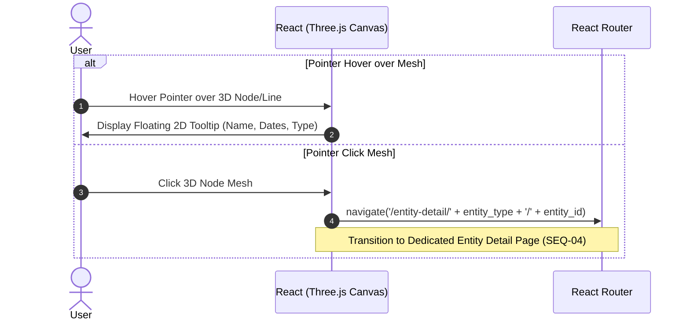

# SEQ-03: HASM 3D Visualizer & Dynamic Creation Controls (Architecture Sequence)

This document details the visual concept, 3D space mapping logic, state validation guards, event-driven layout computation, and **interactive entity creation triggers (Create PERSON, EXPERIENCE, FACT, LINK)** with automatic 3D scene updating.

---

## 1. Visual & Conceptual Metaphor: Git-like 3D Timeline

The HASM 3D Visualizer represents life experiences and activities in a three-dimensional space by leveraging a **Git Branch & Commit metaphor**:

* **PERSON (No Dedicated Line):** `PERSON` does not render its own node, mesh, or line. Each `EXPERIENCE` node carries its owning PERSON's name, so hovering or clicking an EXPERIENCE trunk also identifies the PERSON it belongs to.
* **EXPERIENCE (Git Branches):** Each `EXPERIENCE` entity is rendered as a continuous parallel line fixed on the **XY plane** and extending along the **Z-axis**, without a separate node mesh. Hovering or clicking the line identifies the EXPERIENCE and its owning PERSON.
* **FACT (Git Commits):** Each `FACT` entity is rendered as a 3D node (commit point) stationed directly on its parent `EXPERIENCE` branch at a specific Z-coordinate calculated from its time metadata.
* **LINK (Relationships):** Relationships between FACTs or other entities are rendered as thin 3D splines or connecting lines spanning through the 3D space.
* **Creation Toolbar:** Persistent 3D control bar providing direct access to **`Create PERSON`**, **`Create EXPERIENCE`**, **`Create FACT`**, and **`Create LINK`** modals.

### Coordinate Policy

The current coordinate policy is intentionally isolated in `src-tauri/src/hasm/visualizer_commands.rs` for later mathematical revision.

1. **Z-axis is time:** FACTs are globally sorted by persisted `FACT.occurred_at` (ISO8601). Earlier dates receive lower Z coordinates.
2. **Time scale:** `Linear` scales the calendar delta from the earliest FACT, `Logarithmic` applies $\log_{10}(\Delta t + 1)$, and `SequentialIndex` assigns equal spacing after chronological sorting. `SequentialIndex` is the default `TimeScaleMode`.
3. **Relationship-aware XY layout:** every EXPERIENCE receives a fixed `(x, y)` coordinate. For an EXPERIENCE at parent depth $d$, $x = 6d$. Its desired lane is $y = \operatorname{mean}(y_{parent}) + 4(i - (n - 1)/2)$, where $i$ is its stable sibling index among $n$ related siblings; a deterministic nearest-free-lane step prevents overlap. Each EXPERIENCE trunk is straight and parallel to Z, beginning at its first FACT and ending at its final FACT; an EXPERIENCE without a FACT has no trunk. PERSON has no coordinate or line of its own.
4. **Smooth branching and merging:** `parent_experience_ids` declares each incoming parent. At the child EXPERIENCE's first FACT Z coordinate, a curved `BRANCH_OUT` connector runs from every parent trunk to the child trunk. At its final FACT Z coordinate, a curved `BRANCH_MERGE` connector returns to every parent. Multiple parents produce both connectors per parent.
5. **Recursive FACT reflection:** a FACT is placed on every directly related EXPERIENCE and all of that EXPERIENCE's recursive ancestors, so child commits remain visible on their parent timelines.
6. **Z-axis timeline, no xy-plane grid:** the xy-plane no longer renders a grid/border. Instead, a single Z-axis timeline is drawn beside the graph with a tick at every distinct FACT Z coordinate and a label showing that FACT's `occurred_at` date (or its sequence number as a fallback). Tick positions come directly from the FACT Z coordinates already produced by the selected `TimeScaleMode`, so the timeline adapts automatically to `Linear`, `Logarithmic`, or `SequentialIndex`.
7. **Per-EXPERIENCE color families:** each EXPERIENCE trunk is assigned $\text{hue}_i = (i \times 137.508°) \bmod 360°$ (the golden angle), which keeps every branch's color maximally distinguishable from its neighbors regardless of how many EXPERIENCEs exist. FACT commit spheres reuse their EXPERIENCE's hue blended toward the theme's text color, so a FACT reads as a related but visibly different tint of its own trunk rather than sharing an identical or unrelated color. All generated colors are nudged toward WCAG AA contrast (ratio ≥ 4.5) against the active background.

The persisted model currently represents child relationships through each child’s `parent_experience_ids`; no duplicated `child_ids` column is required.

### Scene Navigation

The Three.js canvas uses `OrbitControls`: mouse wheel zooms, left-drag orbits the camera, right-drag pans, and touch input supports orbit/pinch navigation. Node raycasting remains active for stationary hover and click selection.

### Development Graph Package

The Open Workspace page (`/select`) includes **Test 3D commit graph** for development. It invokes `create_visualizer_demo_workspace`, which recreates a populated temporary HASM package containing `hasm.db`, all entity folders, non-empty `main.md` files, and `assets/` directories. The package contains a root EXPERIENCE, a derived research branch, a writing branch with two parents (merge), and five dated FACT commits before routing directly to `/visualizer`.

---

## 2. Sequence Architecture Chapters

### Implemented Module Mapping

The current implementation separates the visualizer into `src/features/visualizer/layoutFilter.js` for filter state, `src/features/visualizer/threeCommitGraph.js` for Three.js scene ownership and node interaction, and `src/pages/VisualizerPage.jsx` for IPC, progress, watchdog, and routing. Rust returns generic `Node3dGeometry` and `Line3dGeometry` from `src-tauri/src/hasm/visualizer_commands.rs`; coordinate policy is intentionally isolated there for later revision.

### Chapter 1: Initial View Load, State Validation Guards & Async Progress Streaming

Triggered automatically when the user navigates to `/visualizer`. Spawns a background worker thread for layout calculation and emits `visualizer-layout-progress` events.

```mermaid
sequenceDiagram
    autonumber
    actor User as User
    participant React as React (VisualizerPage.tsx)
    participant Router as React Router
    participant Bridge as Tauri IPC Bridge / listen()
    participant Rust as Rust Command (visualizer.rs)
    participant Model as HasmModel (In-Memory)

    Note over User,Model: Pre-condition: User attempts to load /visualizer route.

    React->>Bridge: Setup Event Listener: listen('visualizer-layout-progress')
    React->>React: Mount VisualizerPage & Set Initial State<br/>{ isDataLoading: true, layoutProgress: 0, loadingMessage: "Initializing 3D Engine..." }
    React->>React: Initialize Default Filter State:<br/>{ timeRange: [Min, Max], securityLevel: All, timeScaleMode: "SequentialIndex", zScaleFactor: 1.0 }
    
    React->>Bridge: invoke('compute_visualizer_layout', { filter: initialFilter })
    Bridge->>Rust: IPC: compute_visualizer_layout(filter)

    %% Guard Check
    break On Missing HasmModel in Rust Memory (code: "ERR_NO_ACTIVE_MODEL")
        Rust-->>Bridge: Return Err(ModelError { code: "ERR_NO_ACTIVE_MODEL" })
        Bridge-->>React: Reject Promise
        React->>Router: navigate('/select')
    end

    %% Async Layout Stream
    rect rgb(15, 23, 42)
        Note over Rust,Model: Background Layout Calculation (tokio::task::spawn_blocking)
        Rust->>Model: Filter & Calculate 3D Coordinates (XY Branches & Z-Axis)
        Rust-->>Bridge: emit('visualizer-layout-progress', { current, total, percentage, message })
        Bridge-->>React: Update Progress Bar Overlay State
    end

    Rust-->>Bridge: Return Ok(RenderPayload { nodes3D, lines3D, warnings })
    Bridge-->>React: Resolve Promise (renderPayload)
    
    React->>React: Initialize Three.js Scene, Camera, Lights & Add Meshes
    React->>User: Render Initial 3D World Scene

```

---

### Chapter 2: Interactive Entity & Link Creation Triggers (Visualizer UI Actions)

Triggered when the user clicks **"Create PERSON"**, **"Create EXPERIENCE"**, **"Create FACT"**, or **"Create LINK"** from the Visualizer Toolbar. Invokes the `SEQ-08` creation pipeline and automatically triggers a layout re-computation (`compute_visualizer_layout`) upon successful creation to render the new node/spline smoothly.

```mermaid
sequenceDiagram
    autonumber
    actor User as User
    participant React as React (VisualizerPage.tsx / Canvas)
    participant Modal as Creation Modal (CreateEntityModal / CreateLinkModal)
    participant Bridge as Tauri IPC Bridge
    participant Rust as Rust Engine (entity_commands.rs / visualizer.rs)

    Note over User,Rust: User is viewing 3D Scene and wants to add a new Entity or Relationship.

    alt Option A: Create PERSON / EXPERIENCE / FACT
        User->>React: Click "Create PERSON" / "EXPERIENCE" / "FACT" Button
        React->>Modal: Open Target Entity Creation Form Modal
        User->>Modal: Input Name, Description, Dates & Submit
        
        Modal->>Bridge: invoke('create_person' / 'create_experience' / 'create_fact', payload)
        Note over Bridge,Rust: Hand-off to SEQ-08 Chapter 2 (SQLite Insertion & UUID Folder Scaffolding)
        Rust-->>Bridge: Return Ok(EntityCreationPayload)
        Bridge-->>Modal: Resolve Promise
        Modal->>React: Close Modal & Trigger Graph Re-layout Event

    else Option B: Create LINK (Connect 2 Nodes)
        alt Via Toolbar Click
            User->>React: Click "Create LINK" Button
            React->>Modal: Open Create Link Form Modal (Select Origin & Target Dropdowns)
        else Via Direct 3D Canvas Drag/Selection
            User->>React: Click Origin Node + Shift-Click Target Node in 3D Canvas
            React->>Modal: Open Create Link Modal Pre-populated with Selected Node IDs
        end

        User->>Modal: Select Link Type & Click "Connect"
        Modal->>Bridge: invoke('create_link', createLinkPayload)
        Note over Bridge,Rust: Hand-off to SEQ-08 Chapter 3 (Link Validation & SQLite Persistence)
        Rust-->>Bridge: Return Ok(EntityCreationPayload)
        Bridge-->>Modal: Resolve Promise
        Modal->>React: Close Modal & Trigger Graph Re-layout Event
    end

    %% Automatic 3D Re-layout Execution
    rect rgb(15, 23, 42)
        Note over React,Rust: Re-fetch Updated Graph Geometry
        React->>Bridge: invoke('compute_visualizer_layout', { filter: activeFilter })
        Bridge->>Rust: Compute Layout with New Entity Included
        Rust-->>Bridge: Return Ok(UpdatedRenderPayload)
        Bridge-->>React: Resolve Promise
        React->>React: Update Three.js Scene Meshes & Splines
        React->>User: Display Toast Success & Smoothly Animate Camera to New Entity Node
    end

```

---

### Chapter 3: Node Hover & Click Navigation

Triggered when hovering or clicking a 3D Mesh in the Canvas.

