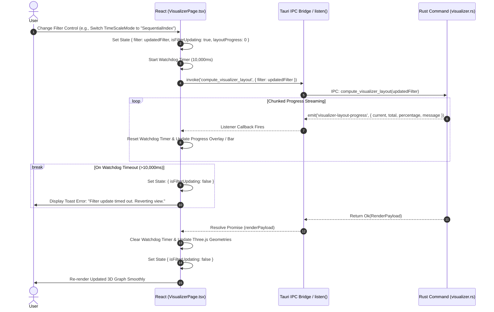
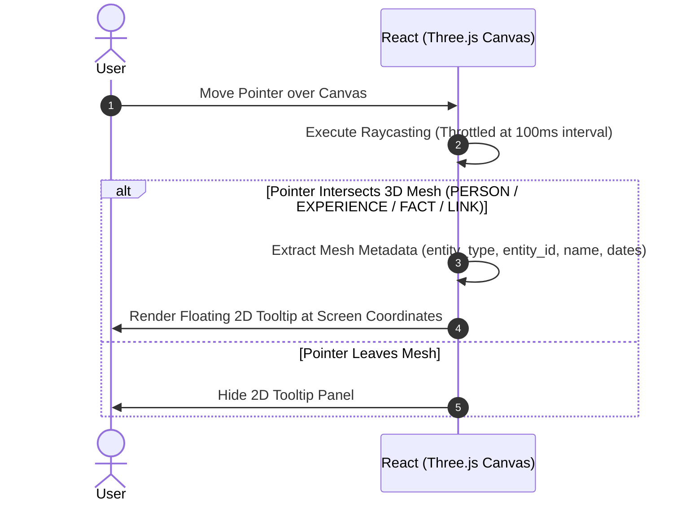
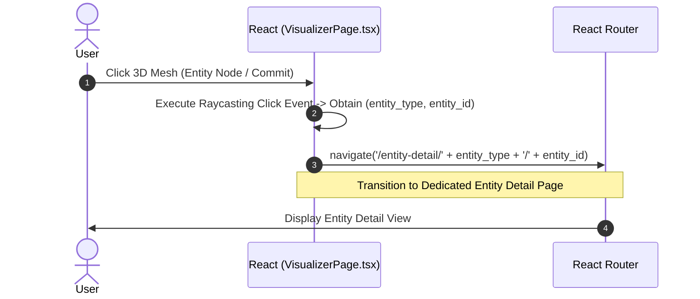

# SEQ-03: HASM 3D Visualizer (Event-Driven Architecture Sequence)

This document details the visual concept, 3D space mapping logic, state validation guards, and event-driven layout computation with **granular progress streaming (`emit`)** for the HASM 3D Visualizer (`/visualizer`).

---

## 1. Visual & Conceptual Metaphor: Git-like 3D Timeline

The HASM 3D Visualizer represents life experiences and activities in a three-dimensional space by leveraging a **Git Branch & Commit metaphor**:

* **EXPERIENCE (Git Branches):** Each `EXPERIENCE` entity is rendered as a continuous parallel line fixed on the **XY plane** and extending along the **Z-axis**.
* **FACT (Git Commits):** Each `FACT` entity is rendered as a 3D node (commit point) stationed directly on its parent `EXPERIENCE` branch at a specific Z-coordinate calculated from its time metadata.
* **LINK (Relationships):** Relationships between FACTs or other entities are rendered as thin 3D splines or connecting lines spanning through the 3D space.
* **Time Axis (Z-axis):** The **Z-axis represents time advancement**. The spatial mapping of Z-coordinates supports three user-selectable modes (`TimeScaleMode`):
1. `Linear`: Z-distance is strictly proportional to elapsed time ($\Delta t$).
2. `Logarithmic`: Z-distance scales logarithmically ($\log_{10}(\Delta t)$) to balance dense and sparse time periods.
3. `SequentialIndex`: Z-distance is determined by chronological index ($0, 1, 2, \dots, N$) with equal spacing, ensuring every commit remains distinctly readable like a Git commit log.


```
       [ Z-Axis : Time Axis ]
                 ▲
                 │   (FACT: Commit C2)
                 │     [Sphere]
                 │        │
                 │        │ (EXPERIENCE: Branch B)
                 │     [Sphere]
                 │   (FACT: Commit C1)
                 │        │
  (XY Plane)     │        │
   ┌─────────────┼────────┼─────────────┐
   │            /         │             │
   │           /          │             │
   │          /           │             │
   │   (EXPERIENCE: Branch A)           │
   └────────────────────────────────────┘

```

---

## 2. Data Contracts & Time Constraints

### 2.1 IPC Data Definitions (Rust / TypeScript Interface)

```rust
// Layout calculation filter request payload
#[derive(Debug, Serialize, Deserialize)]
pub struct LayoutFilterRequest {
    pub time_range: (Option<String>, Option<String>), // ISO8601 Strings
    pub security_level: Option<i32>,
    pub time_scale_mode: TimeScaleMode, // "Linear" | "Logarithmic" | "SequentialIndex"
    pub z_scale_factor: f32,
}

// Event payload emitted during background layout calculation
#[derive(Debug, Serialize, Deserialize)]
pub struct LayoutProgressPayload {
    pub current: usize,
    pub total: usize,
    pub percentage: f32,
    pub message: String, // e.g. "Positioning FACT nodes (450/1000)..."
}

// Final 3D render payload returned to React Three.js Scene
#[derive(Debug, Serialize, Deserialize)]
pub struct RenderPayload {
    pub nodes_3d: Vec<Node3DGeometry>,
    pub lines_3d: Vec<Line3DGeometry>,
    pub warnings: Vec<String>,
}

```

### 2.2 Time Constraints Policy Matrix

| Operation | Timeout Rule | Timeout Value | Timeout Action & Handling |
| --- | --- | --- | --- |
| **Layout Computation Stream** (`compute_visualizer_layout`) | Watchdog Timer (Pattern B) | **10,000 ms** (Without event) | Cancel calculation; reject IPC; display toast error or fallback to `/error-model`. |

---

## 3. Participant Lifecycle Legend

* **User**: End user interacting with the 3D Canvas / Filter controls.
* **React**: `VisualizerPage.tsx` and Three.js Canvas State Manager.
* **Router**: `React Router` navigation engine.
* **Bridge**: `Tauri IPC Bridge / listen()`.
* **Rust**: `visualizer.rs` / Worker Thread in Rust backend.
* **Model**: `HasmModel` in-memory domain instance.

---

## 4. Sequence Architecture Chapters

### Chapter 1: Initial View Load, State Validation Guards & Async Progress Streaming

Triggered automatically when the user navigates to `/visualizer`.
Executes strict state validations against Rust memory, spawns a background worker thread for layout calculation, and emits `visualizer-layout-progress` events to render a smooth progress bar.

```mermaid
sequenceDiagram
    autonumber
    actor User as User
    participant React as React (VisualizerPage.tsx)
    participant Router as React Router
    participant Bridge as Tauri IPC Bridge / listen()
    participant Rust as Rust Command (visualizer.rs)
    participant Model as HasmModel (In-Memory)

    Note over User,Model: Pre-condition: User attempts to load /visualizer route.

    React->>Bridge: Setup Event Listener: listen('visualizer-layout-progress')
    React->>React: Mount VisualizerPage & Set Initial State<br/>{ isDataLoading: true, layoutProgress: 0, loadingMessage: "Initializing 3D Engine...", renderError: null }
    React->>React: Initialize Default Filter State:<br/>{ timeRange: [Min, Max], securityLevel: All, timeScaleMode: "Linear", zScaleFactor: 1.0 }
    
    React->>React: Start Watchdog Timer (Threshold: 10,000ms without progress event)
    React->>Bridge: invoke('compute_visualizer_layout', { filter: initialFilter })
    Bridge->>Rust: IPC: compute_visualizer_layout(filter)

    %% ----------------------------------------------------
    %% Guard 1: No Active HasmModel in Rust Memory
    %% ----------------------------------------------------
    break On Missing HasmModel in Rust Memory (code: "ERR_NO_ACTIVE_MODEL")
        Rust-->>Bridge: Return Err(ModelError { code: "ERR_NO_ACTIVE_MODEL" })
        Bridge-->>React: Reject Promise (ERR_NO_ACTIVE_MODEL)
        React->>React: Set State: { isDataLoading: false, renderError: "No active model loaded" }
        React->>Router: navigate('/select')
        Note over React,Router: Fallback Redirect to Model Selection Screen
    end

    %% ----------------------------------------------------
    %% Guard 2: HasmModel Present but Unverified (is_verified == false)
    %% ----------------------------------------------------
    break On Unverified HasmModel State (code: "ERR_MODEL_NOT_VERIFIED")
        Rust-->>Bridge: Return Err(ModelError { code: "ERR_MODEL_NOT_VERIFIED" })
        Bridge-->>React: Reject Promise (ERR_MODEL_NOT_VERIFIED)
        React->>React: Set State: { isDataLoading: false }
        React->>Router: navigate('/loading-model', { state: { modelPath, returnTo: '/visualizer' } })
        Note over React,Router: Transition to Loading Page for Storage Re-verification (SEQ-02)
    end

    %% ----------------------------------------------------
    %% Async Worker Execution & Progress Streaming (Large Data Support)
    %% ----------------------------------------------------
    rect rgb(15, 23, 42)
        Note over Rust,Model: Spawn Async Worker Thread (tokio::task::spawn_blocking)
        
        Rust-->>Bridge: emit('visualizer-layout-progress', { current: 0, total: Total, percentage: 10.0, message: "Filtering Entities..." })
        Bridge-->>React: Listener Callback Fires: LayoutProgressPayload
        React->>React: Reset Watchdog Timer to 0ms & Update State: { layoutProgress: 10.0, loadingMessage }

        Rust->>Model: Filter entities by timeRange and securityLevel

        Rust-->>Bridge: emit('visualizer-layout-progress', { current: ExpCount, total: Total, percentage: 40.0, message: "Positioning EXPERIENCE Branches..." })
        Bridge-->>React: Listener Callback Fires: LayoutProgressPayload
        React->>React: Reset Watchdog Timer to 0ms & Update State: { layoutProgress: 40.0, loadingMessage }

        Rust->>Rust: Calculate XY Branch Layout

        loop Chunked FACT Processing (e.g., Every 200 FACTs)
            Rust-->>Bridge: emit('visualizer-layout-progress', { current: ProcessedFacts, total: FactCount, percentage: P, message: "Calculating Z-coordinates..." })
            Bridge-->>React: Listener Callback Fires: LayoutProgressPayload
            React->>React: Reset Watchdog Timer to 0ms & Update Smooth Progress UI State:<br/>{ layoutProgress: P, loadingMessage }
            Rust->>Rust: Compute Z-coordinates according to TimeScaleMode
        end

        Rust-->>Bridge: emit('visualizer-layout-progress', { current: Total, total: Total, percentage: 90.0, message: "Building 3D Geometry Splines..." })
        Bridge-->>React: Listener Callback Fires: LayoutProgressPayload
        React->>React: Reset Watchdog Timer to 0ms & Update State: { layoutProgress: 90.0, loadingMessage }

        Rust->>Rust: Pack into RenderPayload { nodes3D, lines3D, warnings }

        break On Watchdog Timeout (>10,000ms elapsed since LAST progress event)
            React->>React: Set State: { isDataLoading: false, renderError: "Layout calculation stalled" }
            React->>Router: navigate('/error-model')
        end
    end

    Rust-->>Bridge: Return Ok(RenderPayload)
    Bridge-->>React: Resolve Promise (renderPayload)
    
    React->>React: Clear Watchdog Timer & Store renderPayload<br/>Set State { isDataLoading: false, layoutProgress: 100.0 }
    
    alt Has Model Warnings
        React->>React: Render Warning Banner / Toast (Unreferenced Folders)
    end

    React->>React: Initialize Three.js Scene, Camera, Lights & Add Meshes
    React->>User: Render Initial 3D World Scene Smoothly

```



---

### Chapter 2: Filter & Scale Update Event with Async Progress

Triggered when the user adjusts the Time Slider, changes `TimeScaleMode` (`Linear`, `Logarithmic`, `SequentialIndex`), or toggles Security Levels.



---

### Chapter 3: Node Hover Event (Pointer Raycasting)

Triggered continuously as the user moves the mouse cursor over the 3D Canvas.



---

### Chapter 4: Node Click Event (Entity Navigation)

Triggered when the user clicks a specific 3D Mesh (Node / Commit / Line) on the Canvas.

