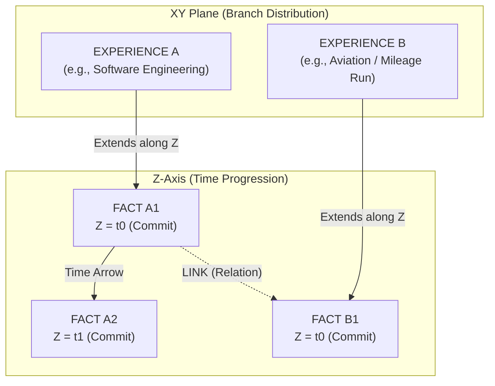
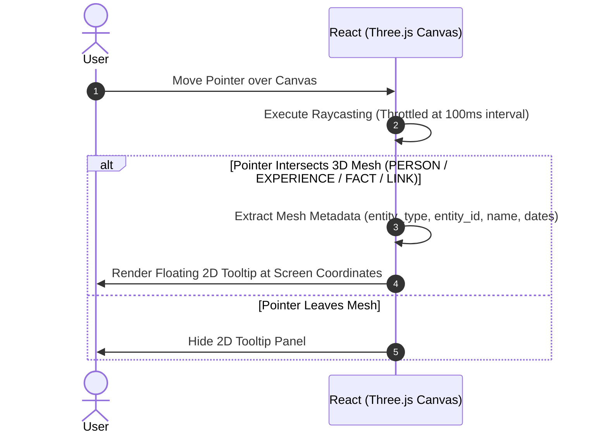
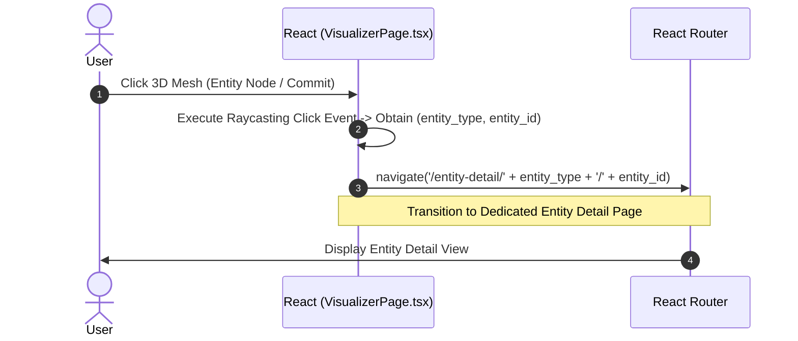

# SEQ-03: HASM 3D Visualizer (Event-Driven Architecture Sequence)

This document details the visual concept, 3D space mapping logic, and event-driven interactions for the HASM 3D Visualizer (`/visualizer`), divided into distinct chapters per User Event trigger.

## Visual & Conceptual Metaphor: Git-like 3D Timeline

The HASM 3D Visualizer represents life experiences and activities in a three-dimensional space by leveraging a **Git Branch & Commit metaphor**:

* **EXPERIENCE (Git Branches):** Each `EXPERIENCE` entity is rendered as a continuous parallel line fixed on the **XY plane** and extending along the **Z-axis**.
* **FACT (Git Commits):** Each `FACT` entity is rendered as a 3D node (commit point) stationed directly on its parent `EXPERIENCE` branch at a specific Z-coordinate calculated from its time metadata.
* **LINK (Relationships):** Relationships between FACTs or other entities are rendered as thin 3D splines or connecting lines spanning through the 3D space.
* **Time Axis (Z-axis):** The **Z-axis represents time advancement**. The spatial mapping of Z-coordinates supports three user-selectable modes (`TimeScaleMode`):
1. `Linear`: Z-distance is strictly proportional to elapsed time ($\Delta t$).
2. `Logarithmic`: Z-distance scales logarithmically ($\log_{10}(\Delta t)$) to balance dense and sparse time periods.
3. `SequentialIndex`: Z-distance is determined by chronological index ($0, 1, 2, \dots, N$) with equal spacing, ensuring every commit remains distinctly readable like a Git commit log.


```
       [ Z-Axis : Time Axis ]
                 ▲
                 │   (FACT: Commit C2)
                 │     [Sphere]
                 │        │
                 │        │ (EXPERIENCE: Branch B)
                 │     [Sphere]
                 │   (FACT: Commit C1)
                 │        │
  (XY Plane)     │        │
   ┌─────────────┼────────┼─────────────┐
   │            /         │             │
   │           /          │             │
   │          /           │             │
   │   (EXPERIENCE: Branch A)           │
   └────────────────────────────────────┘

```



---

## Participant Lifecycle Legend

All event chapters share the standardized lifecycle participants:

* **User**: End user interacting with the 3D Canvas / UI controls.
* **React**: `VisualizerPage.tsx` and Three.js Canvas State Manager.
* **Router**: `React Router` navigation engine.
* **Bridge**: `Tauri IPC Bridge` for async Command invoking.
* **Rust**: `visualizer.rs` / `HasmModel` in-memory backend engine.
* **FS**: Local File System / Workspace Storage.

---

## Chapter 1: Initial View Load Event & State Validation Guards

Triggered automatically when the user navigates to `/visualizer`. 
Executes strict state validations against the Rust backend memory:
1. **Unloaded Model Guard:** Redirects to `/select` if no `HasmModel` is loaded in Rust memory.
2. **Unverified Model Guard:** Redirects to `/loading-model` if the `HasmModel` is unverified (`is_verified == false`).

### Sequence Diagram



```mermaid
sequenceDiagram
    autonumber
    actor User as User
    participant React as React (VisualizerPage.tsx)
    participant Router as React Router
    participant Bridge as Tauri IPC Bridge / listen()
    participant Rust as Rust Command (visualizer.rs / HasmModel)
    participant FS as File System / Workspace

    Note over User,FS: Pre-condition: User attempts to load /visualizer route.

    React->>React: Mount VisualizerPage & Set Initial State<br/>{ isDataLoading: true, renderError: null }
    React->>React: Initialize Default Filter State:<br/>{ timeRange: [Min, Max], securityLevel: All, timeScaleMode: "Linear", zScaleFactor: 1.0 }
    
    React->>Bridge: invoke('compute_visualizer_layout', { filter: initialFilter })
    Bridge->>Rust: IPC: compute_visualizer_layout(filter)

    %% ----------------------------------------------------
    %% Guard 1: No Active HasmModel in Rust Memory
    %% ----------------------------------------------------
    break On Missing HasmModel in Rust Memory (code: "ERR_NO_ACTIVE_MODEL")
        Rust-->>Bridge: Return Err(ModelError { code: "ERR_NO_ACTIVE_MODEL" })
        Bridge-->>React: Reject Promise (ERR_NO_ACTIVE_MODEL)
        React->>React: Set State: { isDataLoading: false, renderError: "No active model loaded" }
        React->>Router: navigate('/select')
        Note over React,Router: Fallback Redirect to Model Selection Screen
    end

    %% ----------------------------------------------------
    %% Guard 2: HasmModel Present but Unverified (is_verified == false)
    %% ----------------------------------------------------
    break On Unverified HasmModel State (code: "ERR_MODEL_NOT_VERIFIED")
        Rust-->>Bridge: Return Err(ModelError { code: "ERR_MODEL_NOT_VERIFIED" })
        Bridge-->>React: Reject Promise (ERR_MODEL_NOT_VERIFIED)
        React->>React: Set State: { isDataLoading: false }
        React->>Router: navigate('/loading-model', { state: { modelPath, returnTo: '/visualizer' } })
        Note over React,Router: Transition to Loading Page for Storage Re-verification (SEQ-02)
    end

    %% ----------------------------------------------------
    %% Timeout Guard: Hard Timeout Execution (>5,000ms)
    %% ----------------------------------------------------
    break On Hard Timeout (>5,000ms without response)
        React->>React: Set State: { isDataLoading: false, renderError: "3D Layout calculation timed out" }
        React->>Router: navigate('/error-model')
        Note over React,Router: Display Visualizer Error Page
    end

    %% ----------------------------------------------------
    %% Normal Execution: Model Loaded & Verified -> Compute 3D Geometry
    %% ----------------------------------------------------
    rect rgb(15, 23, 42)
        Note over Rust: Rust 3D Layout Logic (Active & Verified Model)
        Rust->>Rust: 1. Filter entities by timeRange and securityLevel
        Rust->>Rust: 2. Position EXPERIENCE branches on XY plane
        Rust->>Rust: 3. Position FACT commits on Z-axis based on TimeScaleMode
        Rust->>Rust: 4. Pack into RenderPayload { nodes3D, lines3D, warnings }
    end

    Rust-->>Bridge: Return Ok(RenderPayload)
    Bridge-->>React: Resolve Promise (renderPayload)
    React->>React: Store renderPayload & Set State { isDataLoading: false }
    
    alt Has Model Warnings
        React->>React: Render Warning Banner / Toast (Unreferenced Folders)
    end

    React->>React: Initialize Three.js Scene, Camera, Lights & Add Meshes
    React->>User: Render Initial 3D World Scene
```

## Chapter 2: Filter & Scale Update Event (Control Interaction)

Triggered when the user adjusts the Time Slider, changes `TimeScaleMode` (`Linear`, `Logarithmic`, `SequentialIndex`), or toggles Security Levels.

### Sequence Diagram



```mermaid
sequenceDiagram
    autonumber
    actor User as User
    participant React as React (VisualizerPage.tsx)
    participant Bridge as Tauri IPC Bridge
    participant Rust as Rust Command (visualizer.rs)

    User->>React: Change Filter Control (e.g., Switch TimeScaleMode to "SequentialIndex")
    React->>React: Set State { filter: updatedFilter, isFilterUpdating: true }
    
    React->>Bridge: invoke('compute_visualizer_layout', { filter: updatedFilter })
    Bridge->>Rust: IPC: compute_visualizer_layout(updatedFilter)
    
    break On Hard Timeout (>5,000ms)
        React->>React: Set State: { isFilterUpdating: false }
        React->>User: Display Toast Error: "Filter update timed out. Reverting view."
    end

    rect rgb(15, 23, 42)
        Note over Rust: Re-evaluate Z-axis with TimeScaleMode
        alt mode == "Linear"
            Rust->>Rust: Z = (start_time - base_time) * zScaleFactor
        else mode == "Logarithmic"
            Rust->>Rust: Z = log10(start_time - base_time + 1) * zScaleFactor
        else mode == "SequentialIndex"
            Rust->>Rust: Sort FACTs chronologically -> Z = index * step_distance * zScaleFactor
        end
    end

    Rust-->>Bridge: Return Ok(RenderPayload)
    Bridge-->>React: Resolve Promise (renderPayload)
    
    React->>React: Update Three.js Geometries & Positions
    React->>React: Set State { isFilterUpdating: false }
    React->>User: Re-render Updated 3D Graph Smoothly

```

## Chapter 3: Node Hover Event (Pointer Raycasting)

Triggered continuously as the user moves the mouse cursor over the 3D Canvas.

### Sequence Diagram



## Chapter 4: Node Click Event (Entity Navigation)

Triggered when the user clicks a specific 3D Mesh (Node / Commit / Line) on the Canvas.

### Sequence Diagram

