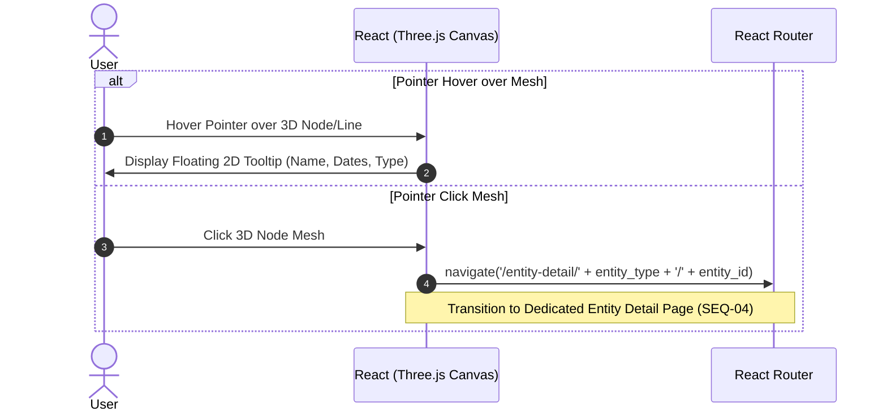

# SEQ-03: HASM 3D Visualizer & Dynamic Creation Controls (Architecture Sequence)

This document details the visual concept, 3D space mapping logic, state validation guards, event-driven layout computation, and **interactive entity creation triggers (Create PERSON, EXPERIENCE, FACT, LINK)** with automatic 3D scene updating.

---

## 1. Visual & Conceptual Metaphor: Git-like 3D Timeline

The HASM 3D Visualizer represents life experiences and activities in a three-dimensional space by leveraging a **Git Branch & Commit metaphor**:

* **EXPERIENCE (Git Branches):** Each `EXPERIENCE` entity is rendered as a continuous parallel line fixed on the **XY plane** and extending along the **Z-axis**.
* **FACT (Git Commits):** Each `FACT` entity is rendered as a 3D node (commit point) stationed directly on its parent `EXPERIENCE` branch at a specific Z-coordinate calculated from its time metadata.
* **LINK (Relationships):** Relationships between FACTs or other entities are rendered as thin 3D splines or connecting lines spanning through the 3D space.
* **Creation Toolbar:** Persistent 3D control bar providing direct access to **`Create PERSON`**, **`Create EXPERIENCE`**, **`Create FACT`**, and **`Create LINK`** modals.

---

## 2. Sequence Architecture Chapters

### Chapter 1: Initial View Load, State Validation Guards & Async Progress Streaming

Triggered automatically when the user navigates to `/visualizer`. Spawns a background worker thread for layout calculation and emits `visualizer-layout-progress` events.

```mermaid
sequenceDiagram
    autonumber
    actor User as User
    participant React as React (VisualizerPage.tsx)
    participant Router as React Router
    participant Bridge as Tauri IPC Bridge / listen()
    participant Rust as Rust Command (visualizer.rs)
    participant Model as HasmModel (In-Memory)

    Note over User,Model: Pre-condition: User attempts to load /visualizer route.

    React->>Bridge: Setup Event Listener: listen('visualizer-layout-progress')
    React->>React: Mount VisualizerPage & Set Initial State<br/>{ isDataLoading: true, layoutProgress: 0, loadingMessage: "Initializing 3D Engine..." }
    React->>React: Initialize Default Filter State:<br/>{ timeRange: [Min, Max], securityLevel: All, timeScaleMode: "Linear", zScaleFactor: 1.0 }
    
    React->>Bridge: invoke('compute_visualizer_layout', { filter: initialFilter })
    Bridge->>Rust: IPC: compute_visualizer_layout(filter)

    %% Guard Check
    break On Missing HasmModel in Rust Memory (code: "ERR_NO_ACTIVE_MODEL")
        Rust-->>Bridge: Return Err(ModelError { code: "ERR_NO_ACTIVE_MODEL" })
        Bridge-->>React: Reject Promise
        React->>Router: navigate('/select')
    end

    %% Async Layout Stream
    rect rgb(15, 23, 42)
        Note over Rust,Model: Background Layout Calculation (tokio::task::spawn_blocking)
        Rust->>Model: Filter & Calculate 3D Coordinates (XY Branches & Z-Axis)
        Rust-->>Bridge: emit('visualizer-layout-progress', { current, total, percentage, message })
        Bridge-->>React: Update Progress Bar Overlay State
    end

    Rust-->>Bridge: Return Ok(RenderPayload { nodes3D, lines3D, warnings })
    Bridge-->>React: Resolve Promise (renderPayload)
    
    React->>React: Initialize Three.js Scene, Camera, Lights & Add Meshes
    React->>User: Render Initial 3D World Scene

```

---

### Chapter 2: Interactive Entity & Link Creation Triggers (Visualizer UI Actions)

Triggered when the user clicks **"Create PERSON"**, **"Create EXPERIENCE"**, **"Create FACT"**, or **"Create LINK"** from the Visualizer Toolbar. Invokes the `SEQ-08` creation pipeline and automatically triggers a layout re-computation (`compute_visualizer_layout`) upon successful creation to render the new node/spline smoothly.

```mermaid
sequenceDiagram
    autonumber
    actor User as User
    participant React as React (VisualizerPage.tsx / Canvas)
    participant Modal as Creation Modal (CreateEntityModal / CreateLinkModal)
    participant Bridge as Tauri IPC Bridge
    participant Rust as Rust Engine (entity_commands.rs / visualizer.rs)

    Note over User,Rust: User is viewing 3D Scene and wants to add a new Entity or Relationship.

    alt Option A: Create PERSON / EXPERIENCE / FACT
        User->>React: Click "Create PERSON" / "EXPERIENCE" / "FACT" Button
        React->>Modal: Open Target Entity Creation Form Modal
        User->>Modal: Input Name, Description, Dates & Submit
        
        Modal->>Bridge: invoke('create_person' / 'create_experience' / 'create_fact', payload)
        Note over Bridge,Rust: Hand-off to SEQ-08 Chapter 2 (SQLite Insertion & UUID Folder Scaffolding)
        Rust-->>Bridge: Return Ok(EntityCreationPayload)
        Bridge-->>Modal: Resolve Promise
        Modal->>React: Close Modal & Trigger Graph Re-layout Event

    else Option B: Create LINK (Connect 2 Nodes)
        alt Via Toolbar Click
            User->>React: Click "Create LINK" Button
            React->>Modal: Open Create Link Form Modal (Select Origin & Target Dropdowns)
        else Via Direct 3D Canvas Drag/Selection
            User->>React: Click Origin Node + Shift-Click Target Node in 3D Canvas
            React->>Modal: Open Create Link Modal Pre-populated with Selected Node IDs
        end

        User->>Modal: Select Link Type & Click "Connect"
        Modal->>Bridge: invoke('create_link', createLinkPayload)
        Note over Bridge,Rust: Hand-off to SEQ-08 Chapter 3 (Link Validation & SQLite Persistence)
        Rust-->>Bridge: Return Ok(EntityCreationPayload)
        Bridge-->>Modal: Resolve Promise
        Modal->>React: Close Modal & Trigger Graph Re-layout Event
    end

    %% Automatic 3D Re-layout Execution
    rect rgb(15, 23, 42)
        Note over React,Rust: Re-fetch Updated Graph Geometry
        React->>Bridge: invoke('compute_visualizer_layout', { filter: activeFilter })
        Bridge->>Rust: Compute Layout with New Entity Included
        Rust-->>Bridge: Return Ok(UpdatedRenderPayload)
        Bridge-->>React: Resolve Promise
        React->>React: Update Three.js Scene Meshes & Splines
        React->>User: Display Toast Success & Smoothly Animate Camera to New Entity Node
    end

```

---

### Chapter 3: Node Hover & Click Navigation

Triggered when hovering or clicking a 3D Mesh in the Canvas.

