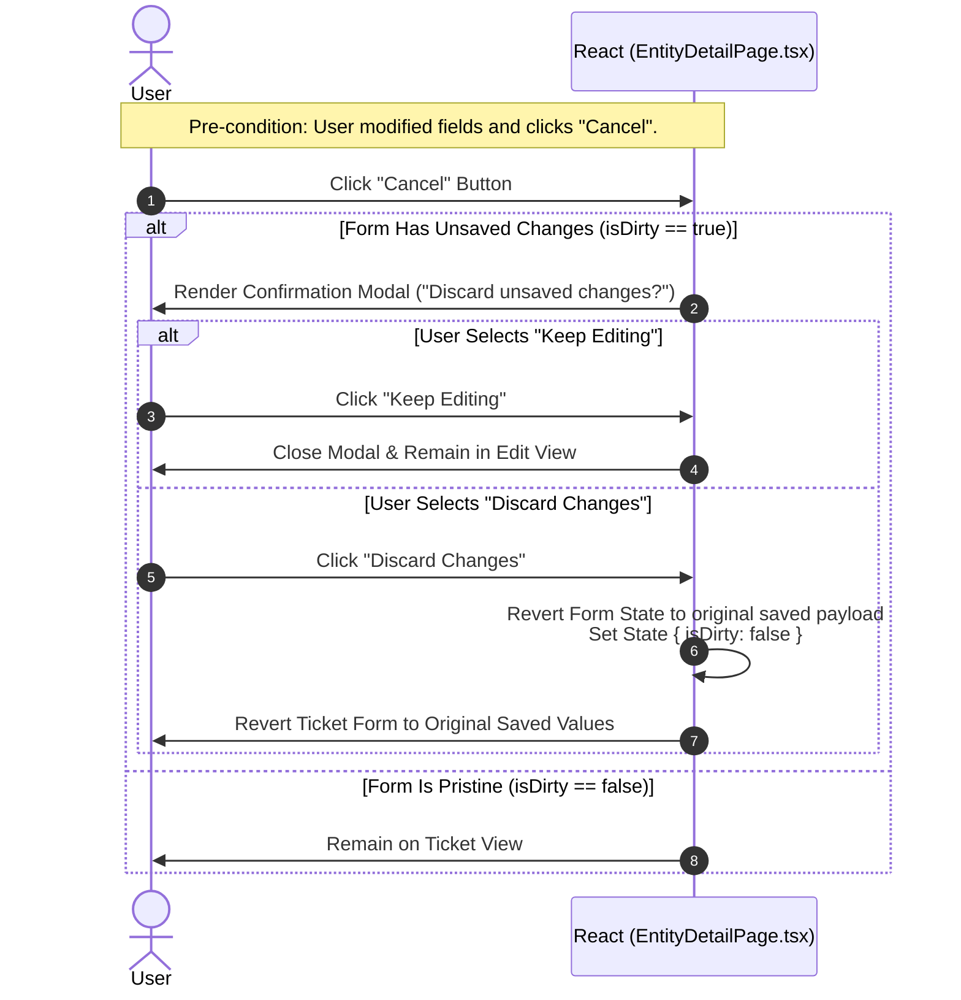

# SEQ-04: Entity MetaData Editing & Saving (Detailed Architecture Specification)

This document provides the complete detailed architectural specification for loading, validating, modifying, saving, canceling, and navigating back from an entity detail ticket (PERSON, EXPERIENCE, FACT, LINK) modeled after a JIRA Task Ticket interface.

* **Diagram Location:** `3. Entity Detail Pages` (`DetailPages` / `PersonDetail`, `ExpDetail`, `FactDetail`, `LinkDetail`)
* **Key Tauri Functions:** `load_entity_detail`, `save_entity_metadata`
* **Description:** Demonstrates loading entity metadata from Rust in-memory state, verifying Markdown via `hasm_markdown.exe` with dynamic timeouts, executing entity-level Rust domain validation before persisting metadata to `hasm.db`, invalidating Rust model verification state (`is_verified = false`), and navigating back to the Visualizer with automatic re-verification triggers.

---

## 1. Data Contracts & Time Constraints

### 1.1 IPC Data Definitions (Rust / TypeScript Interface)

```rust
// Payload for load_entity_detail command
#[derive(Debug, Serialize, Deserialize)]
pub struct LoadEntityRequest {
    pub entity_type: String, // "PERSON" | "EXPERIENCE" | "FACT" | "LINK"
    pub entity_id: Uuid,
}

// Response payload for load_entity_detail
#[derive(Debug, Serialize, Deserialize)]
pub struct EntityDetailPayload {
    pub metadata: EntityMeta,
    pub markdown_body: String,
    pub timeout_used_ms: u64,
}

// Payload for save_entity_metadata command
#[derive(Debug, Serialize, Deserialize)]
pub struct SaveEntityMetadataRequest {
    pub entity_type: String,
    pub entity_id: Uuid,
    pub name: String,
    pub description: Option<String>,
    pub security_level: i32,
    pub start_time: Option<String>, // ISO8601
    pub end_time: Option<String>,   // ISO8601
}

// Error Enum returned to Frontend
#[derive(Debug, Serialize, Deserialize)]
pub enum EntityEditorError {
    EntityNotFound { id: String },
    MarkdownTimeout { timeout_ms: u64 },
    MarkdownVerificationFailed { exit_code: i32, stderr: String },
    EntityVerificationFailed { code: String, message: String },
    SaveTimeout { timeout_ms: u64 },
    DatabaseSaveFailed { message: String },
}

```

### 1.2 Time Constraints Policy Matrix

| Operation | Timeout Rule | Timeout Value | Timeout Action & Rollback |
| --- | --- | --- | --- |
| **Markdown Verification** (`hasm_markdown.exe`) | Dynamic (File Size) | $\min(3000 + \lfloor \frac{\text{SizeKB}}{100} \rfloor \times 1000, 15000)\text{ ms}$ | Kill child process; return `ERR_MARKDOWN_TIMEOUT`; navigate to `/error-markdown`. |
| **Metadata DB Persistence** (`hasm.db`) | Fixed Hard Timeout | **5,000 ms** | `ROLLBACK` SQLite Transaction; return `ERR_SAVE_TIMEOUT`; preserve form state on React UI. |

---

## 2. Entity-Level Domain Validation Rules (Rust `entity.verify()`)

Prior to executing SQLite transactions, the Rust backend instantiates the domain model and invokes `.verify()`. If validation fails, persistence is aborted without modifying the database.

* **`Fact` & `Experience` Verification:**
* `name` MUST NOT be empty or whitespace-only.
* IF both `start_time` and `end_time` are present, `start_time` MUST be chronologically earlier than or equal to `end_time` ($t_{\text{start}} \le t_{\text{end}}$).


* **`Link` Verification:**
* `source_id` MUST NOT be equal to `target_id` (Self-loop forbidden).


* **`Person` Verification:**
* `name` MUST NOT be empty.
* `security_level` MUST fall within valid bounds ($0 \le \text{level} \le 5$).


---

## 3. Sequence Architecture Chapters

### Participant Lifecycle Legend

* **User**: End user interacting with the JIRA-style Entity Detail Ticket UI.
* **React**: `EntityDetailPage.tsx` (JIRA Task Ticket Interface State Manager).
* **Router**: `React Router` navigation engine.
* **Bridge**: `Tauri IPC Bridge / invoke()`.
* **Rust**: `entity_editor.rs` in Rust backend.
* **Entity**: Rust Domain Entity (`Person`, `Experience`, `Fact`, `Link`).
* **SubExe**: `hasm_markdown.exe` submodule process.
* **DB**: SQLite Database (`hasm.db`).
* **FS**: Local File System (`main.md`).

---

### Chapter 1: Loading entity

Triggered automatically when navigating to `/entity-detail/:entity_type/:entity_id`. Fetches metadata from Rust memory and verifies the target `main.md` via `hasm_markdown.exe` using file-size-based dynamic timeouts.

```mermaid
sequenceDiagram
    autonumber
    actor User as User
    participant React as React (EntityDetailPage.tsx)
    participant Router as React Router
    participant Bridge as Tauri IPC Bridge
    participant Rust as Rust Command (entity_editor.rs)
    participant SubExe as Submodule (hasm_markdown.exe)
    participant FS as File System (Entity Folder / main.md)

    Note over User,FS: Pre-condition: User opened /entity-detail/:entity_type/:entity_id. HasmModel metadata resides in Rust memory.

    React->>React: Mount EntityDetailPage & Set Initial State<br/>{ isEntityLoading: true, isMarkdownVerifying: true, isEntitySaving: false }
    
    React->>Bridge: invoke('load_entity_detail', { entityType, entityId })
    Bridge->>Rust: IPC: load_entity_detail(entityType, entityId)
    
    rect rgb(15, 23, 42)
        Note over Rust: 1. Extract Metadata from Rust In-Memory HasmModel
        Rust->>Rust: Lookup entityId in Rust Memory -> Get EntityMeta
    end

    alt Entity Not Found in Memory
        Rust-->>Bridge: Return Err(EntityNotFound)
        Bridge-->>React: Reject Promise
        React->>React: Set State { isEntityLoading: false, isMarkdownVerifying: false }
        React->>Router: navigate('/error-model')
        Note over React,Router: Fallback to Model Error Screen
    end

    rect rgb(15, 23, 42)
        Note over Rust,FS: 2. Calculate Dynamic Timeout & Exec Verification Process
        Rust->>FS: Check main.md File Size (SizeKB)
        Rust->>Rust: Dynamic Timeout = min(3000 + (SizeKB / 100) * 1000, 15000) ms
        
        Rust->>SubExe: Execute Process with Timeout: hasm_markdown.exe verify --path {target_md_path}
        SubExe->>FS: Read & Parse main.md (YAML FrontMatter + Syntax Verification)

        break On Process Execution Timeout (> Dynamic Timeout ms)
            SubExe-->>Rust: Terminate Child Process
            Rust-->>Bridge: Return Err(MarkdownTimeout { timeout_ms })
            Bridge-->>React: Reject Promise
            React->>React: Set State { isEntityLoading: false, isMarkdownVerifying: false }
            React->>Router: navigate('/error-markdown')
            Note over React,Router: Transition to Error HASM Markdown Page
        end
        
        alt Verification Failed
            SubExe-->>Rust: Return Process Exit Code != 0
            Rust-->>Bridge: Return Err(MarkdownVerificationFailed)
            Bridge-->>React: Reject Promise
            React->>React: Set State { isEntityLoading: false, isMarkdownVerifying: false }
            React->>Router: navigate('/error-markdown')
            Note over React,Router: Transition to Error HASM Markdown Page
        else Verification Succeeded
            SubExe-->>Rust: Return Process Exit Code 0 (OK) + Raw Markdown Content
        end
    end

    Rust-->>Bridge: Return Ok(EntityDetailPayload)
    Bridge-->>React: Resolve Promise (payload)
    
    React->>React: Store payload in State & Render Markdown Content
    React->>React: Set State { isEntityLoading: false, isMarkdownVerifying: false }
    React->>User: Display JIRA-style Entity Detail Ticket View

```



---

### Chapter 2: Save edited entity information

Triggered when the user modifies ticket fields and clicks **"Save"**. Executes Rust domain validation, persists metadata updates exclusively to SQLite (`hasm.db`) within a 5,000ms timeout with automatic transaction rollback on failure, invalidates Rust model verification state (`is_verified = false`), and **remains on the Detail Page**.

```mermaid
sequenceDiagram
    autonumber
    actor User as User
    participant React as React (EntityDetailPage.tsx)
    participant Bridge as Tauri IPC Bridge
    participant Rust as Rust Command (entity_editor.rs)
    participant Entity as Rust Domain (Person / Exp / Fact / Link)
    participant DB as SQLite Database (hasm.db)

    Note over User,DB: Pre-condition: User edited ticket metadata fields and clicks "Save".

    User->>React: Click "Save" Button
    React->>React: Set State { isEntitySaving: true }
    
    React->>Bridge: invoke('save_entity_metadata', { entityType, entityId, metadataPayload })
    Bridge->>Rust: IPC: save_entity_metadata(entityType, entityId, metadataPayload)

    %% ----------------------------------------------------
    %% Step 1: Entity-Level Domain Verification in Rust
    %% ----------------------------------------------------
    rect rgb(15, 23, 42)
        Note over Rust,Entity: 1. Entity-Level Domain Validation (Before DB Persistence)
        Rust->>Entity: Instantiate & Call entity.verify()
        
        alt Entity Validation NG (e.g. start_time > end_time)
            Entity-->>Rust: Return Err(EntityValidationError)
            Rust-->>Bridge: Return Err(EntityVerificationFailed)
            Bridge-->>React: Reject Promise
            React->>React: Set State { isEntitySaving: false }
            React->>User: Display Error Popup ("Validation Error: Start time must be earlier than End time")
            Note over React,User: User stays on edit page with input values preserved for correction.
        else Entity Validation OK
            Entity-->>Rust: Return Ok(())
        end
    end

    %% ----------------------------------------------------
    %% Step 2: Persist Metadata to SQLite (hasm.db) with 5,000ms Timeout
    %% ----------------------------------------------------
    rect rgb(15, 23, 42)
        Note over Rust,DB: 2. Persist MetaData to hasm.db
        Rust->>DB: Begin SQLite Transaction & UPDATE entity metadata
        
        break On Save Timeout (> 5,000ms Execution)
            Rust->>DB: ROLLBACK SQLite Transaction
            Rust-->>Bridge: Return Err(SaveTimeout { timeout_ms: 5000 })
            Bridge-->>React: Reject Promise
            React->>React: Set State { isEntitySaving: false }
            React->>User: Display Error Popup ("Save operation timed out. DB changes rolled back.")
        end

        alt DB Persistence Failed (DB Lock / SQL Error)
            DB-->>Rust: SQLite Transaction Error
            Rust->>DB: ROLLBACK SQLite Transaction
            Rust-->>Bridge: Return Err(DatabaseSaveFailed)
            Bridge-->>React: Reject Promise
            React->>React: Set State { isEntitySaving: false }
            React->>User: Display Error Toast ("Failed to save metadata to database.")
        else DB Persistence Success
            Rust->>DB: COMMIT SQLite Transaction
            Rust->>Rust: Set In-Memory HasmModel flag: is_verified = false
        end
    end

    Rust-->>Bridge: Return Ok(SaveResult { entityId })
    Bridge-->>React: Resolve Promise
    
    React->>React: Update Local Form State with saved metadata<br/>Set State { isEntitySaving: false, isDirty: false }
    React->>User: Display Success Toast ("Metadata saved successfully.")
    Note over React,User: Remain on current Entity Detail Page in saved state.

```



---

### Chapter 3: Cancel editing entity information

Triggered when the user clicks **"Cancel"** to discard unsaved edits and revert the ticket form.



---

### Chapter 4: Back to Visualizer

Triggered when the user clicks **"Back to Visualizer"**. Navigates to `/visualizer`. If edits were saved previously (`is_verified == false`), `SEQ-03` Guard 2 automatically intercepts and routes to `/loading-model` for re-verification before 3D rendering.

```mermaid
sequenceDiagram
    autonumber
    actor User as User
    participant React as React (EntityDetailPage.tsx)
    participant Router as React Router

    Note over User,Router: Pre-condition: User clicks "Back to Visualizer" button.

    User->>React: Click "Back to Visualizer" Button
    
    alt Unsaved Changes Exist (isDirty == true)
        React->>User: Render Confirmation Modal ("Discard unsaved changes before leaving?")
        User->>React: Confirm "Leave Page"
    end

    React->>Router: navigate('/visualizer')
    Note over React,Router: Transition to Visualizer Route (SEQ-03 handles SEQ-02 re-verification if is_verified == false)