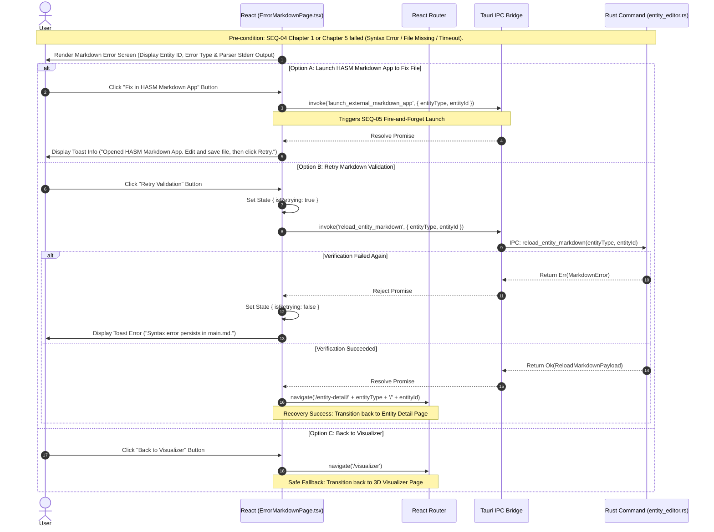

# SEQ-06: Error Fallback & Recovery Flow (Detailed Architecture Specification)

This document provides the complete detailed architectural specification for the unified error fallback and user-driven recovery flows when validation, file missing, syntax, DB corruption, or process timeout errors occur across any application lifecycle phase.

* **Diagram Location:** Across all subgraphs (`ErrorHASMApp`, `ErrorHASMModel`, `ErrorHASMMarkdown`)
* **Key Tauri Functions:** `validate_hasm_app`, `reboot_app`, `exit_app`, `load_hasm_model_db`, `verify_hasm_storage`, `repair_missing_entity_folders`, `reload_entity_markdown`, `launch_external_markdown_app`
* **Description:** Outlines routing fallback strategies, error UI state rendering with appended error cause lists, user retry mechanisms, auto-repair folder creation, path-retaining app reboots, and recovery navigation paths for App System Errors (`ErrorHASMApp`), Model Workspace Errors (`ErrorHASMModel`), and Markdown Syntax/File Errors (`ErrorHASMMarkdown`).

---

## 1. Error Classification & Recovery Strategy Matrix

| Error Type | Triggering Phase | Cause Examples | Navigation Target Page | Recovery Actions Available |
| --- | --- | --- | --- | --- |
| **App System Error** (`ErrorHASMApp`) | `1. Boot Phase` | `hasm_markdown.exe` binary missing; SQLite driver init failed; OS permission denied. | `/error-app` | **1. Retry System Check****2. Reboot App (Retain Path)****3. Exit Application** |
| **Model Workspace Error** (`ErrorHASMModel`) | `1. Boot Phase``SEQ-03` Guards | `hasm.db` corrupted; missing `main.md` directories; schema mismatch. | `/error-model` | **1. Create Missing Folders (Auto-Repair)****2. Retry Model Load****3. Select Different Model** (`/select`) |
| **Markdown Syntax Error** (`ErrorHASMMarkdown`) | `2. Routing Phase``SEQ-04` Chapter 5 | `main.md` YAML FrontMatter syntax error; Markdown timeout; `main.md` deleted. | `/error-markdown` | **1. Open in HASM App to Fix** (`SEQ-05`)**2. Retry Refresh****3. Back to Visualizer** (`/visualizer`) |

---

## 2. Participant Lifecycle Legend

All event chapters share standardized lifecycle participants:

* **User**: End user interacting with Error Screen UI controls.
* **React**: `ErrorAppPage.tsx` / `ErrorModelPage.tsx` / `ErrorMarkdownPage.tsx`.
* **Router**: `React Router` navigation engine.
* **Bridge**: `Tauri IPC Bridge / invoke()`.
* **Rust**: `app_launcher.rs` / `storage.rs` / `entity_editor.rs` in Rust backend.
* **FS**: Local File System / Workspace Storage.

---

## 3. Sequence Architecture Chapters

### Chapter 1: App System Error Recovery (`/error-app`)

Triggered during initial app boot (`SEQ-01`) if system-level preconditions fail. The user can retry system validation, reboot the app while preserving the target HASM workspace path via CLI arguments (`--path`), or exit the application cleanly.

```mermaid
sequenceDiagram
    autonumber
    actor User as User
    participant React as React (ErrorAppPage.tsx)
    participant Router as React Router
    participant Bridge as Tauri IPC Bridge
    participant Rust as Rust Command (app_launcher.rs)

    Note over User,Rust: Pre-condition: SEQ-01 failed and navigated to /error-app with ErrorDetails payload & optional retained modelPath.

    React->>User: Render System Error Screen (Display Error Code, Path & Message)
    
    alt Option A: Retry App Validation
        User->>React: Click "Retry Validation" Button
        React->>React: Set State { isRetrying: true }
        
        React->>Bridge: invoke('validate_hasm_app')
        Bridge->>Rust: IPC: validate_hasm_app()
        
        alt Validation Failed Again
            Rust-->>Bridge: Return Err(AppValidationError)
            Bridge-->>React: Reject Promise
            React->>React: Set State { isRetrying: false }
            React->>User: Display Toast ("System validation failed again.")
        else Validation Succeeded
            Rust-->>Bridge: Return Ok(AppConfigPayload)
            Bridge-->>React: Resolve Promise
            React->>Router: navigate('/select')
            Note over React,Router: Recovery Success: Transition to Model Select Page
        end
    else Option B: Reboot Application (With Retained Path)
        User->>React: Click "Reboot Application" Button
        React->>Bridge: invoke('reboot_app', { retainPath: modelPath })
        Bridge->>Rust: IPC: reboot_app(retainPath)
        
        rect rgb(15, 23, 42)
            Note over Rust: Spawn New Process & Retain Path
            alt retainPath is Present
                Rust->>Rust: Spawn std::env::current_exe() with CLI arg `--path {retainPath}`
            else retainPath is None
                Rust->>Rust: Spawn std::env::current_exe() without path argument
            end
            Rust->>User: Terminate current desktop process and launch new instance
        end
    else Option C: Exit Application
        User->>React: Click "Exit Application" Button
        React->>Bridge: invoke('exit_app')
        Bridge->>Rust: Terminate Desktop Process Cleanly
    end

```

---

### Chapter 2: Model Workspace Error Recovery & Folder Auto-Repair (`/error-model`)

Triggered during model loading (`SEQ-02`) or Visualizer state guard interception (`SEQ-03`) when `hasm.db` is corrupted or required entity directories are missing. Renders the detailed list of appended error reasons (`VerificationResult`). If missing directories caused the error, the user can trigger an automatic folder structure repair (`repair_missing_entity_folders`), retry loading, or pick another workspace.

```mermaid
sequenceDiagram
    autonumber
    actor User as User
    participant React as React (ErrorModelPage.tsx)
    participant Router as React Router
    participant Bridge as Tauri IPC Bridge
    participant Rust as Rust Command (storage.rs)
    participant FS as File System (Workspace Directory)

    Note over User,FS: Pre-condition: SEQ-02 failed or SEQ-03 Guard intercepted corrupt HasmModel with detailed VerificationResult.

    React->>User: Render Model Error Screen (Display workspace path, Appended Error Details List & Missing UUID Folders)
    
    alt Option A: Create Missing Folders (If missing_entities list is non-empty)
        User->>React: Click "Create Missing Folders" Button
        React->>React: Set State { isRepairing: true }
        
        React->>Bridge: invoke('repair_missing_entity_folders', { workspacePath, missingEntities: errorContext.missing_entities })
        Bridge->>Rust: IPC: repair_missing_entity_folders(...)
        
        rect rgb(15, 23, 42)
            Note over Rust,FS: Auto-Create Missing Entity Directories & Templates
            loop For each missing (EntityType, UUID)
                Rust->>FS: Create directory {workspacePath}/{ENTITY_TYPE}/{UUID}/
                Rust->>FS: Write default main.md template and create assets/ folder
            end
        end
        
        Rust-->>Bridge: Return Ok(RepairResult { created_count: N })
        Bridge-->>React: Resolve Promise
        React->>React: Set State { isRepairing: false, isRepaired: true }
        React->>User: Display Info Toast ("Missing folders created successfully. Click 'Retry Loading'.")
    else Option B: Retry Loading Model
        User->>React: Click "Retry Loading" Button
        React->>Router: navigate('/loading-model', { state: { modelPath, forceReload: true } })
        Note over React,Router: Triggers SEQ-02 Full Reload Sequence
    else Option C: Select Different Model
        User->>React: Click "Select Another Model" Button
        React->>Router: navigate('/select')
        Note over React,Router: Safe Fallback: Return to Model Select Page
    end

```

---

### Chapter 3: Markdown Syntax & File Error Recovery (`/error-markdown`)

Triggered when entering an Entity Detail Page (`SEQ-04` Chapter 1), manually refreshing (`SEQ-04` Chapter 5), or if `main.md` was deleted/corrupted. The user can launch `hasm_markdown.exe` (`SEQ-05`) directly from the error page to repair the file, retry validation, or safely navigate back to the 3D Visualizer.

