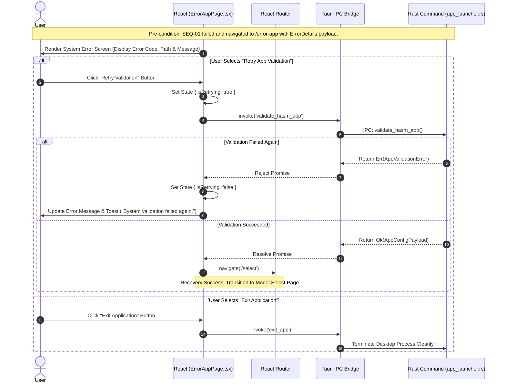
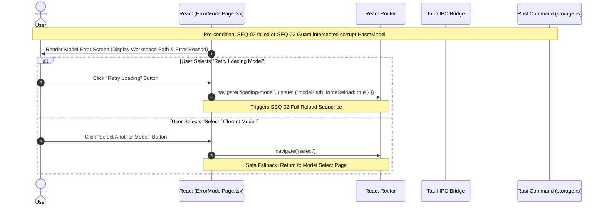

# SEQ-06: Error Fallback & Recovery Flow (Detailed Architecture Specification)

This document provides the complete detailed architectural specification for the unified error fallback and user-driven recovery flows when validation, file missing, syntax, or process timeout errors occur across any application lifecycle phase.

* **Diagram Location:** Across all subgraphs (`ErrorHASMApp`, `ErrorHASMModel`, `ErrorHASMMarkdown`)
* **Key Tauri Functions:** `validate_hasm_app`, `load_hasm_model_db`, `verify_hasm_storage`, `reload_entity_markdown`
* **Description:** Outlines routing fallback strategies, error UI state rendering, user retry mechanisms, and recovery navigation paths for App System Errors (`ErrorHASMApp`), Model Workspace Errors (`ErrorHASMModel`), and Markdown Syntax/File Errors (`ErrorHASMMarkdown`).

---

## 1. Error Classification & Recovery Strategy Matrix

| Error Type | Triggering Phase | Cause Examples | Navigation Target Page | Recovery Action Available |
| --- | --- | --- | --- | --- |
| **App System Error** (`ErrorHASMApp`) | `1. Boot Phase` | `hasm_markdown.exe` binary missing; SQLite driver init failed; OS permission denied. | `/error-app` | **1. Retry System Check****2. Exit Application** |
| **Model Workspace Error** (`ErrorHASMModel`) | `1. Boot Phase``SEQ-03` Guard 2 | `hasm.db` corrupted; workspace directory missing; JSON/SQLite schema mismatch. | `/error-model` | **1. Retry Model Load****2. Select Different Model** (`/select`) |
| **Markdown Syntax Error** (`ErrorHASMMarkdown`) | `2. Routing Phase``SEQ-04` Chapter 5 | `main.md` YAML FrontMatter syntax error; Markdown timeout; `main.md` missing/deleted. | `/error-markdown` | **1. Open in HASM App to Fix** (`SEQ-05`)**2. Retry Refresh****3. Back to Visualizer** (`/visualizer`) |

---

## 2. Sequence Architecture Chapters

### Participant Lifecycle Legend

* **User**: End user interacting with Error Screen UI.
* **React**: `ErrorAppPage.tsx` / `ErrorModelPage.tsx` / `ErrorMarkdownPage.tsx`.
* **Router**: `React Router` navigation engine.
* **Bridge**: `Tauri IPC Bridge / invoke()`.
* **Rust**: Rust backend error handling modules.

---

### Chapter 1: App System Error Recovery (`/error-app`)

Triggered during initial app boot (`SEQ-01`) if system-level preconditions fail. The user can retry validation or exit the desktop application cleanly.



---

### Chapter 2: Model Workspace Error Recovery (`/error-model`)

Triggered during model loading (`SEQ-02`) or Visualizer state guard interception (`SEQ-03`) when `hasm.db` is unreadable or corrupted. The user can retry loading the current workspace path or return to `/select` to choose another model.



---

### Chapter 3: Markdown Syntax & File Error Recovery (`/error-markdown`)

Triggered when entering an Entity Detail Page (`SEQ-04` Chapter 1), manually refreshing (`SEQ-04` Chapter 5), or if `main.md` was deleted/corrupted. The user can launch `hasm_markdown.exe` (`SEQ-05`) directly from the error page to repair the file, retry validation, or safely navigate back to the 3D Visualizer.

```mermaid
sequenceDiagram
    autonumber
    actor User as User
    participant React as React (ErrorMarkdownPage.tsx)
    participant Router as React Router
    participant Bridge as Tauri IPC Bridge
    participant Rust as Rust Command (entity_editor.rs)

    Note over User,Rust: Pre-condition: SEQ-04 Chapter 1 or Chapter 5 failed (Syntax Error / File Missing / Timeout).

    React->>User: Render Markdown Error Screen (Display Entity ID, Error Type & Parser Output)
    
    alt Option A: Launch HASM Markdown App to Fix File
        User->>React: Click "Fix in HASM Markdown App" Button
        React->>Bridge: invoke('launch_external_markdown_app', { entityType, entityId })
        Note over React,Bridge: Triggers SEQ-05 Fire-and-Forget Launch
        Bridge-->>React: Resolve Promise
        React->>User: Display Toast Info ("Opened HASM Markdown App. Edit and save file, then click Retry.")
    else Option B: Retry Markdown Validation
        User->>React: Click "Retry Validation" Button
        React->>React: Set State { isRetrying: true }
        
        React->>Bridge: invoke('reload_entity_markdown', { entityType, entityId })
        Bridge->>Rust: IPC: reload_entity_markdown(entityType, entityId)
        
        alt Verification Failed Again
            Rust-->>Bridge: Return Err(MarkdownError)
            Bridge-->>React: Reject Promise
            React->>React: Set State { isRetrying: false }
            React->>User: Display Toast Error ("Syntax error persists in main.md.")
        else Verification Succeeded
            Rust-->>Bridge: Return Ok(ReloadMarkdownPayload)
            Bridge-->>React: Resolve Promise
            React->>Router: navigate('/entity-detail/' + entityType + '/' + entityId)
            Note over React,Router: Recovery Success: Transition back to Entity Detail Page
        end
    else Option C: Back to Visualizer
        User->>React: Click "Back to Visualizer" Button
        React->>Router: navigate('/visualizer')
        Note over React,Router: Transition back to 3D Visualizer Page
    end