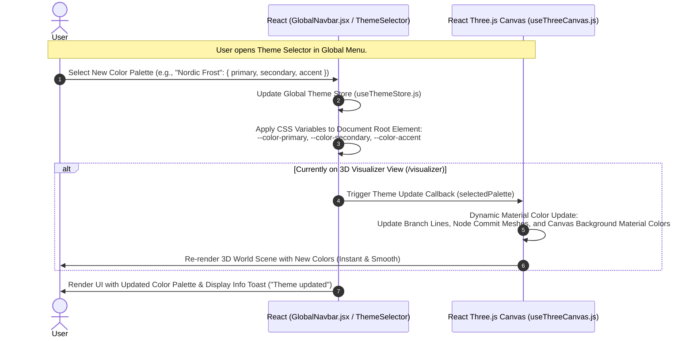
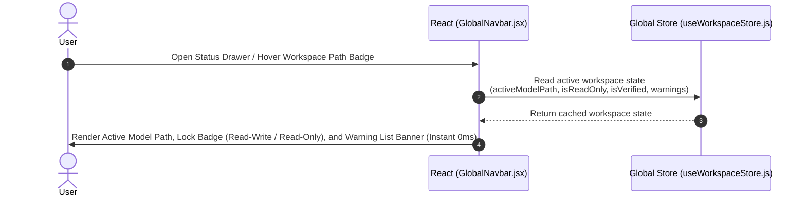
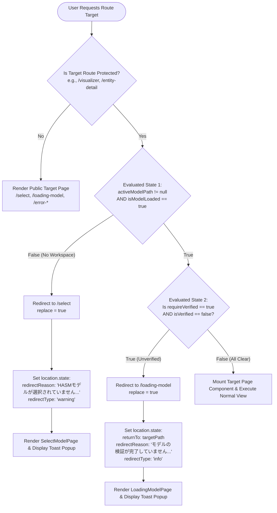

# SEQ-07: Global Navigation, Environment Management & Route Protection

This document provides the detailed technical sequence and specifications for cross-cutting application capabilities:

1. **Global Top Navigation Menu Bar**
2. **Clean Workspace Switching (`switch_workspace_cleanly`)**
3. **Dynamic Color Theme Customization**
4. **Synchronous Workspace Status Monitoring**
5. **Route Protection & Redirection Matrix (Barrier 1 Guard)**

---

## 1. Key Features & Architectural Scope

1. **Global Navigation Menu Bar (`GlobalNavbar.jsx`):** Persistent top-bar UI offering quick access to active workspace metadata, theme customization, and workspace switching actions.
2. **Workspace Switching Flow (`/select` Switch):** Safe transition mechanism allowing users to leave the active workspace and select a new one. Guarantees atomic release of the active workspace lock (`release_workspace_lock`), flushing SQLite connection pools, and resetting the in-memory Rust `HasmModel` before navigating back to `/select`.
3. **Dynamic Color Theme Selector:** Real-time theme switching mechanism supporting preset 3-color palettes (Primary, Secondary, Accent) that update both React UI CSS variables and Three.js 3D material color tokens immediately without scene re-renders.
4. **Synchronous Workspace Status Monitor:** Displays the current loaded HASM path and active verification warnings directly from `useWorkspaceStore.js` (0ms IPC latency).
5. **Global Route Protection (Barrier 1):** Centrally guarded by `ProtectedRoute.jsx` wrapping operational views (`/visualizer`, `/entity-detail/...`). Intercepts direct URL navigation or state violations, redirects users to safe recovery routes, and passes human-readable explanation messages for Toast rendering.

---

## 2. Data Contracts & IPC Specifications

```rust
// Payload for switch_workspace_cleanly command
#[derive(Debug, Serialize, Deserialize)]
pub struct SwitchWorkspaceRequest {
    pub current_model_path: String,
}

// Payload for theme color token updates
#[derive(Debug, Serialize, Deserialize)]
pub struct ColorPalette {
    pub id: String,         // e.g., "cyberpunk_dark" | "nordic_frost" | "slate_emerald"
    pub primary: String,    // Hex Code
    pub secondary: String,  // Hex Code
    pub accent: String,     // Hex Code
}

```

---

## 3. Sequence Architecture Chapters

### 3.1. Workspace Switching & Clean Unload Flow (`/select` Transition)

Triggered when the user clicks **"Switch Model / Select Workspace"** in the Global Menu. If unsaved edits exist in an Entity Detail Page, the user is prompted to confirm. Upon confirmation, Rust cleanly releases the active workspace lock (`release_workspace_lock`), flushes SQLite handles, purges the in-memory `HasmModel`, and routes to `/select`.

```mermaid
sequenceDiagram
    autonumber
    actor User as User
    participant React as React (GlobalNavbar.jsx / Route State)
    participant Router as React Router
    participant Bridge as Tauri IPC Bridge
    participant Rust as Rust Command (app_environment.rs)
    participant FS as File System (.hasm/lock)

    Note over User,FS: Pre-condition: User is currently working inside a workspace (/visualizer or /entity-detail).

    User->>React: Click "Switch Model" in Global Menu
    
    alt Active Form Has Unsaved Changes (isDirty == true)
        React->>User: Display Confirmation Modal ("Discard unsaved changes before switching workspace?")
        
        alt User Clicks "Cancel"
            User->>React: Click "Cancel"
            React->>User: Close Modal & Remain in Current View
        else User Clicks "Discard & Switch"
            User->>React: Click "Discard & Switch"
        end
    end

    React->>React: Set Loading Overlay State: { isSwitchingWorkspace: true }
    
    rect rgb(15, 23, 42)
        Note over React,FS: Atomic Workspace Release & Memory Cleanup
        React->>Bridge: invoke('switch_workspace_cleanly', { currentModelPath: activeModelPath })
        Bridge->>Rust: IPC: switch_workspace_cleanly(...)

        opt Active Workspace was Read-Write (isReadOnly == false)
            Rust->>FS: Remove .hasm/lock file for activeModelPath
            FS-->>Rust: Lock File Removed
        end

        Rust->>Rust: Flush & close SQLite connection handles for active hasm.db
        Rust->>Rust: Reset In-Memory HasmModel instance to None (is_verified = false)
        
        Rust-->>Bridge: Return Ok(())
        Bridge-->>React: Resolve Promise
    end

    React->>React: Reset Global React Store (activeModelPath = null, isVerified = false, isReadOnly = false)
    React->>React: Clear Loading Overlay State
    React->>Router: navigate('/select')
    Note over React,Router: Safe Transition: Return to Workspace Selector Page (SEQ-01 / SEQ-02)
    Router->>User: Render Select Model Page (/select)

```



---

### 3.2. Dynamic Color Theme Switching Flow

Triggered when the user selects a preset 3-color palette (e.g., *Cyberpunk Dark*, *Nordic Frost*, *Slate Emerald*) from the Global Theme Dropdown. Instantly applies CSS custom properties to the React DOM and emits a theme update signal to the Three.js 3D Viewport (`useThreeCanvas.js`).



---

### 3.3. Synchronous Workspace Status Monitoring

Reads active workspace status, model path, lock badge, and verification warnings directly from `useWorkspaceStore.js` synchronously (0ms IPC latency).



---

## 4. Route Protection & Redirection Matrix (Barrier 1)

This chapter defines the non-sequence logic for route protection. `ProtectedRoute.jsx` intercepts unauthorized page access (URL direct typing, DevTools navigation, or invalid state transitions) before any component mounts or IPC executes.

### 4.1 Route Decision Flow Chart



---

### 4.2 Route Protection Evaluation Matrix

The following table explicitly defines every combination of requested routes, evaluated state variables, target redirection pages, pass-through state metadata, and UI toast behaviors.

| Request Route Target | Evaluated State Variables (`useWorkspaceStore`) | Protection Decision | Destination Route | Passed Router State (`location.state`) | User Toast / UI Behavior |
| --- | --- | --- | --- | --- | --- |
| **`/visualizer`** or **`/entity-detail/:type/:id`** | `activeModelPath == null`OR `isModelLoaded == false` | **BLOCKED**(No Workspace) | **`/select`** | `from: requestedPath``redirectReason: "HASMモデルが選択されていません。先にワークスペースを選択してください。"``redirectType: "warning"` | Displays Amber Warning Toast on `SelectModelPage`. Clears router state immediately to prevent re-display on page refresh. |
| **`/visualizer`** or **`/entity-detail/:type/:id`** | `activeModelPath != null``isModelLoaded == true``isVerified == false` | **BLOCKED**(Unverified State) | **`/loading-model`** | `returnTo: requestedPath``redirectReason: "モデルの検証が完了していません。再ロード・検証を実行します。"``redirectType: "info"` | Displays Info Toast on `LoadingModelPage`. Automatically re-triggers storage verification (`SEQ-02`). |
| **`/visualizer`** or **`/entity-detail/:type/:id`** | `activeModelPath != null``isModelLoaded == true``isVerified == true` | **ALLOWED** | Requested Target Route | None | Renders requested target page component smoothly without interruption. |
| **Unknown / Invalid Route** (e.g., `/unknown-page`) | Any State Combination | **BLOCKED**(Fallback Guard) | **`/select`** | `redirectReason: "指定されたページが存在しません。"``redirectType: "warning"` | Displays Amber Warning Toast on `SelectModelPage`. |
| **`/select`**, **`/loading-model`**, **`/error-*`** | Any State Combination | **ALLOWED**(Unprotected Route) | Requested Route | Preserved if provided | Renders public/system page component directly. |