# SEQ-08: Entity Creation & Link Graph Binding Sequence (修正版)

## 1. Data Contracts & Time Constraints

### 1.1 IPC Data Definitions (Rust / TypeScript Interface)

```rust
// Payload for create_hasm_workspace command
#[derive(Debug, Serialize, Deserialize)]
pub struct CreateWorkspaceRequest {
    pub target_directory_path: String, // Absolute OS directory path selected via File Dialog (e.g. "/path/to/MyLife.hasm")
}

// Payload for create_person command
#[derive(Debug, Serialize, Deserialize)]
pub struct CreatePersonRequest {
    pub person_name: String,
    pub person_description: String,
    pub security_level: i32,
    pub create_life_experience: bool, // If true, auto-generates a root EXPERIENCE stream
}

// Payload for create_experience command
#[derive(Debug, Serialize, Deserialize)]
pub struct CreateExperienceRequest {
    pub experience_name: String,
    pub experience_description: String,
    pub security_level: i32,
    pub parent_experience_ids: Vec<Uuid>, // Parent branches in EXPERIENCE_TREE
}

// Payload for create_fact command
#[derive(Debug, Serialize, Deserialize)]
pub struct CreateFactRequest {
    pub fact_name: String,
    pub fact_description: String,
    pub start_time: Option<String>, // ISO8601 String
    pub end_time: Option<String>,   // ISO8601 String
    pub security_level: i32,
    pub experience_ids: Vec<Uuid>,  // Associated EXPERIENCE timelines in FACT_EXPERIENCE
}

// Payload for create_link command
#[derive(Debug, Serialize, Deserialize)]
pub struct CreateLinkRequest {
    pub link_type: String, // e.g. "causes", "references", "mentors"
    pub link_description: String,
    pub origin_entity_type: EntityType, // "Person" | "Experience" | "Fact"
    pub origin_entity_id: Uuid,
    pub target_entity_type: EntityType, // "Person" | "Experience" | "Fact"
    pub target_entity_id: Uuid,
    pub security_level: i32,
}

// Universal response payload returned to Frontend upon entity creation
#[derive(Debug, Serialize, Deserialize)]
pub struct EntityCreationPayload {
    pub entity_type: EntityType,
    pub entity_id: Uuid,
    pub target_dir_path: String,
    pub created_at_ms: u64,
}

```

### 1.2 Time Constraints Policy Matrix

| Operation | Timeout Rule | Timeout Value | Timeout Action & Rollback |
| --- | --- | --- | --- |
| **Directory Selection & Workspace Scaffolding** (`create_hasm_workspace`) | Fixed Hard Timeout | **3,000 ms** | Delete partially created `.hasm` directory; return `ERR_WORKSPACE_CREATION_FAILED`. |
| **Entity Creation Transaction** (`create_person`, `create_fact`, etc.) | Fixed Hard Timeout | **5,000 ms** | `ROLLBACK` SQLite Transaction; delete generated UUID directory; return `ERR_ENTITY_CREATE_TIMEOUT`. |
| **Link Integrity Check** (`create_link`) | Instant In-Memory | **< 5 ms** | Reject creation if source/target UUID missing from `HasmModel` memory or if `origin == target`.

 |

---

## 2. Pre-Persistence Invariant Rules (`entity.verify()`)

Before executing SQLite `INSERT` statements or filesystem scaffolding, Rust instantiates the target domain struct and invokes `.verify()`:

1. **PERSON Verification:** `person_name` MUST NOT be empty or whitespace-only. `security_level` MUST fall within $0 \le \text{level} \le 5$.


2. **EXPERIENCE Verification:** `experience_name` MUST NOT be empty.


3. **FACT Verification:** `fact_name` MUST NOT be empty. If both `start_time` and `end_time` are provided, $t_{\text{start}} \le t_{\text{end}}$ MUST be satisfied.


4. **LINK Verification:** `link_type` MUST NOT be empty. `origin_entity_id` and `target_entity_id` MUST NOT be identical (Self-loop forbidden). Source and Target entities MUST physically exist in memory.


---

## 3. Sequence Architecture Chapters

### Chapter 1: New Workspace Location Picker & Scaffolding Flow (`create_hasm_workspace`)

Triggered from `SelectModelPage` (`/select`) when the user selects "Create New HASM Model". Opens the native OS save directory dialog first, receives the absolute path (e.g. `/path/to/MyLife.hasm`), scaffolds the directory structure, initializes `hasm.db` with SQLite schemas, and writes `.hasm/lock`.

```mermaid
sequenceDiagram
    autonumber
    actor User as User
    participant React as React (SelectModelPage.jsx)
    participant Dialog as OS Native File Dialog
    participant Router as React Router
    participant Bridge as Tauri IPC Bridge
    participant Rust as Rust Command (model_commands.rs)
    participant FS as File System (.hasm Workspace)

    User->>React: Click "Create New HASM Model"
    React->>Dialog: Trigger OS Save/Directory Picker
    User->>Dialog: Select Target Location & Name (e.g., "/path/to/MyLife.hasm")
    
    alt User Cancels Dialog
        Dialog-->>React: Return Cancelled State
        React->>User: Close Picker & Remain on Select Page
    else Location Selected
        Dialog-->>React: Return targetDirectoryPath
        React->>React: Set Loading State { isCreatingWorkspace: true }

        React->>Bridge: invoke('create_hasm_workspace', { targetDirectoryPath })
        Bridge->>Rust: IPC: create_hasm_workspace(...)

        rect rgb(15, 23, 42)
            Note over Rust,FS: Atomic Workspace Scaffolding (< 3,000ms)
            Rust->>FS: Create base directory: {targetDirectoryPath}/
            Rust->>FS: Create subdirectories: PERSON/, EXPERIENCE/, FACT/, LINK/
            
            Rust->>FS: Initialize SQLite DB at {targetDirectoryPath}/hasm.db
            Rust->>FS: Execute DDL Schemas (Tables & Junction Tables)
            
            Rust->>FS: Create lock file: .hasm/lock ({ "pid": current_pid })
        end

        alt Scaffolding Failed or Timed Out
            FS-->>Rust: I/O or SQLite Init Error
            Rust->>FS: Rollback: Remove newly created workspace or scaffolded artifacts
            Rust-->>Bridge: Return Err(WorkspaceCreationError)
            Bridge-->>React: Reject Promise
            React->>React: Set Loading State { isCreatingWorkspace: false }
            React->>User: Display Toast Error ("Failed to scaffold new workspace.")
        else Scaffolding Succeeded
            Rust-->>Bridge: Return Ok(WorkspacePathPayload)
            Bridge-->>React: Resolve Promise
            React->>Router: navigate('/loading-model', { state: { path: targetDirectoryPath } })
            Note over React,Router: Route to SEQ-02 for initial workspace loading
        end
    end

```



After workspace creation, if `load_hasm_model_db` returns zero entities (`PERSON+EXPERIENCE+FACT+LINK == 0`), the frontend routes to `/initialize-model` before `/visualizer`. The initialization page collects the minimum required input (`person_name`) and invokes `create_person` with:

- `security_level = 1`
- `create_life_experience = true`

This guarantees a non-empty model for first visualizer load.

---

### Chapter 2: Entity Creation & File Scaffolding (`create_person / experience / fact`)

Triggered from a **dedicated Entity Creation page** (`/entity-create`) opened by the **"Create New Entity"** button on the Visualizer (`/visualizer`). Each entity type uses a split frontend component so form design can evolve independently. The backend validates input, writes SQLite records, scaffolds `{ENTITY_TYPE}/{UUID}/main.md`, updates Rust memory, and invalidates verification state (`is_verified = false`).

```mermaid
sequenceDiagram
    autonumber
    actor User as User
    participant React as React (CreateEntityModal.jsx)
    participant Bridge as Tauri IPC Bridge
    participant Rust as Rust Command (entity_commands.rs)
    participant Entity as Rust Domain Entity
    participant DB as SQLite Database (hasm.db)
    participant FS as File System ({UUID}/main.md)

    User->>React: Fill Modal Form & Click "Create Entity"
    React->>React: Set State { isSubmitting: true }

    React->>Bridge: invoke('create_person', payload) // Or create_experience / create_fact
    Bridge->>Rust: IPC: create_person(payload)

    rect rgb(15, 23, 42)
        Note over Rust,Entity: 1. Instantiate Domain Struct & Execute verify()
        Rust->>Entity: Instantiate struct with Uuid::new_v4()
        Rust->>Entity: Call entity.verify()

        alt Domain Validation NG (e.g., Empty Name)
            Entity-->>Rust: Return Err(EntityValidationError)
            Rust-->>Bridge: Return Err(EntityVerificationFailed)
            Bridge-->>React: Reject Promise
            React->>React: Set State { isSubmitting: false }
            React->>User: Display Form Error ("Entity name cannot be empty.")
        end

        Note over Rust,FS: 2. Begin SQLite Transaction & Filesystem Scaffolding
        Rust->>DB: BEGIN SQLite Transaction
        Rust->>DB: INSERT INTO PERSON / EXPERIENCE / FACT & Junction Tables
        
        Rust->>FS: Create directory: {workspace}/{ENTITY_TYPE}/{UUID}/
        Rust->>FS: Create assets/ subdirectory
        Rust->>FS: Write template main.md with YAML FrontMatter

        break On Transaction / File Write Failure or Timeout (> 5,000ms)
            Rust->>DB: ROLLBACK SQLite Transaction
            Rust->>FS: Remove directory {workspace}/{ENTITY_TYPE}/{UUID}/ (if created)
            Rust-->>Bridge: Return Err(EntityCreationError)
            Bridge-->>React: Reject Promise
            React->>React: Set State { isSubmitting: false }
            React->>User: Display Toast Error ("Entity creation failed. Rolled back.")
        end

        Rust->>DB: COMMIT SQLite Transaction
        
        Note over Rust: 3. Memory Sync & State Invalidation
        Rust->>Rust: Append entity to in-memory HasmModel
        Rust->>Rust: Set in-memory HasmModel flag: is_verified = false
    end

    Rust-->>Bridge: Return Ok(EntityCreationPayload)
    Bridge-->>React: Resolve Promise (payload)

    React->>React: Close Modal & Trigger 3D Visualizer Refresh
    React->>User: Display Success Toast & Render New Node in 3D Canvas

```



---

### Chapter 3: Interactive Link Graph Binding Flow (`create_link`)

Triggered when connecting two nodes in 3D space or via the **"Create LINK"** modal. Enforces strict graph constraints (prevents self-loops and orphan edge creations).

```mermaid
sequenceDiagram
    autonumber
    actor User as User
    participant React as React (CreateLinkModal.jsx / ThreeCanvas)
    participant Bridge as Tauri IPC Bridge
    participant Rust as Rust Command (entity_commands.rs)
    participant LinkDomain as Rust Domain Link
    participant DB as SQLite Database (hasm.db)
    participant FS as File System (LINK/{UUID}/)

    User->>React: Select Origin Node, Target Node & Link Type -> Click "Connect"
    React->>React: Set State { isLinking: true }

    React->>Bridge: invoke('create_link', createLinkPayload)
    Bridge->>Rust: IPC: create_link(createLinkPayload)

    rect rgb(15, 23, 42)
        Note over Rust,LinkDomain: 1. Link Invariant & Graph Integrity Checks
        Rust->>Rust: Verify origin_entity_id & target_entity_id exist in HasmModel memory
        
        alt Source or Target Node Missing in Memory
            Rust-->>Bridge: Return Err(OrphanLinkError)
            Bridge-->>React: Reject Promise
            React->>User: Display Error Toast ("Origin or Target entity no longer exists.")
        end

        Rust->>LinkDomain: Instantiate Link struct & Call link.verify()

        alt Self-Loop Detected (origin_id == target_id)
            LinkDomain-->>Rust: Return Err(SelfLoopLink)
            Rust-->>Bridge: Return Err(EntityVerificationFailed)
            Bridge-->>React: Reject Promise
            React->>User: Display Form Error ("Cannot create a link pointing to the same entity.")
        end

        Note over Rust,FS: 2. Persist LINK Metadata & File Directory
        Rust->>DB: BEGIN SQLite Transaction
        Rust->>DB: INSERT INTO LINK (link_id, link_type, origin_*, target_*, ...)
        
        Rust->>FS: Create directory: {workspace}/LINK/{UUID}/
        Rust->>FS: Write default main.md template and assets/ directory

        Rust->>DB: COMMIT SQLite Transaction
        Rust->>Rust: Append Link to HasmModel & Set is_verified = false
    end

    Rust-->>Bridge: Return Ok(EntityCreationPayload)
    Bridge-->>React: Resolve Promise

    React->>React: Close Link Modal & Re-compute 3D Visualizer Layout (SEQ-03)
    React->>User: Render New 3D Spline Line Between Nodes

```

